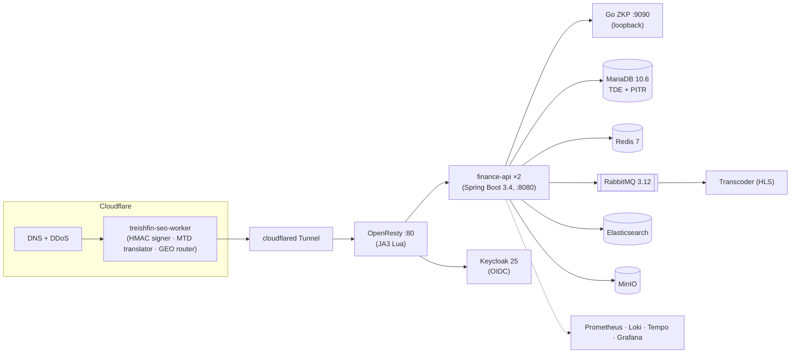

# Treishvaam `finance-api`

**Enterprise backend for the Treishvaam Group financial-media platform.**

Java 21 · Spring Boot 3.4 · AEGIS zero-trust security · MariaDB 10.6 · Redis 7 · RabbitMQ 3.12 · Elasticsearch 8.17 · MinIO · Keycloak 25 · Cloudflare Edge

---

## Table of Contents

1. [About](#about)
2. [Architecture at a Glance](#architecture-at-a-glance)
3. [Technology Stack](#technology-stack)
4. [Documentation](#documentation)
5. [Quick Start (Development)](#quick-start-development)
6. [Configuration & Secrets](#configuration--secrets)
7. [Testing](#testing)
8. [Deployment](#deployment)
9. [Operational Safety Rules](#operational-safety-rules)
10. [License](#license)

---

## About

`finance-api` is the backend core of the Treishvaam Group platform — a **modular monolith** serving the finance media site (market data, editorial content pipeline, audience analytics, GEO/AI search surfaces) across two tenants (`finance`, `agro`). The browser never talks to it directly: every request traverses the Cloudflare Edge Worker, which HMAC-signs it, translates rotating MTD paths, and injects tenant/geo headers.

**AEGIS** — the 9-layer zero-trust fabric:

| Layer | Control |
|---|---|
| L1 | Post-quantum hybrid tokens — Dilithium5 / ML-DSA-87 (BouncyCastle, sole PQC provider) |
| L2 | Zero-Knowledge-Proof gating for `/api/v1/admin/**` (Go gRPC verifier) |
| L3 | Active deception — honeypots, poison payloads, connection tarpits |
| L4 | Cloudflare Edge HMAC-SHA-512 request signing (±300 s window, 403 on failure) |
| L5 | Entropy & behavioral scoring (JA3 / biometric risk model) |
| L6 | Keycloak OIDC JWT + role-based access control |
| L7 | Distributed rate limiting (Bucket4j + Redis) |
| L8 | Input sanitization, SQL signing, content-integrity HMACs |
| L9 | Moving Target Defense — admin paths rotate to `/api/v1/node/{hex}` every 24 h |

Satellites: **Go ZKP verifier** (gRPC, loopback-only) · **Python video transcoder** (ffmpeg → 1080p HLS) · **Python market updater** (yfinance → MariaDB).

---

## Architecture at a Glance



Full topology (24 services), request lifecycle, filter chain, and the services deep-dive: **[docs/BE-01-ARCHITECTURE.md](docs/BE-01-ARCHITECTURE.md)**.

---

## Technology Stack

| Domain | Technology |
|---|---|
| Language / Runtime | Java 21 (Temurin), Spring Boot 3.4.0, WAR packaging |
| Security | Spring Security OAuth2 Resource Server · BouncyCastle 1.78.1 (PQC) · Bucket4j 8.10.1 · ANTLR4 (AEL policy DSL) |
| Identity | Keycloak 25.0.0 (realm `treishvaam`, PKCE S256 public client) |
| Database | MariaDB 10.6 (×2: app + Keycloak), TDE at rest, ROW binlog PITR, Liquibase V1→V50 |
| Cache / Messaging / Search / Storage | Redis 7 · RabbitMQ 3.12 · Elasticsearch 8.17 · MinIO (presign 7 d) |
| Satellites | Go ZKP gRPC service · Python transcoder (ffmpeg) · Python yfinance updater |
| Ingress | Cloudflare (Worker + Tunnel) → OpenResty nginx (Lua JA3) |
| Observability | Prometheus · Loki + Promtail · Tempo (Zipkin/OTLP) · Grafana |
| CI/CD | GitHub Actions (self-hosted runner, GPG gate) + `auto_deploy.sh` (systemd-detached, tiered ignition) |

---

## Documentation

| Document | Contents |
|---|---|
| [docs/BE-00-INDEX.md](docs/BE-00-INDEX.md) | **Start here** — suite index, code-verified invariants, consolidated open-items register |
| [docs/BE-01-ARCHITECTURE.md](docs/BE-01-ARCHITECTURE.md) | Runtime topology, request lifecycle, filter chain, services layer, threading, tenancy |
| [docs/BE-02-SECURITY.md](docs/BE-02-SECURITY.md) | AEGIS 9-layer deep dive, BCSM consensus, ZKP status, encryption at rest |
| [docs/BE-03-DEPLOYMENT.md](docs/BE-03-DEPLOYMENT.md) | Engine A/B, tiered ignition, anti-regression rules, incident runbook, implementation history |
| [docs/BE-04-API.md](docs/BE-04-API.md) | REST reference — every endpoint, auth tier, DTO, plus how the frontend actually calls it |
| [docs/BE-05-DATABASE.md](docs/BE-05-DATABASE.md) | MariaDB TDE, Liquibase matrix, 23-table inventory, Redis/Rabbit/ES/MinIO |
| [docs/BE-06-OBSERVABILITY.md](docs/BE-06-OBSERVABILITY.md) | Metrics, logs, traces, dashboards, telemetry reality |
| [docs/CROSS-SYSTEM-CONTEXT.md](docs/CROSS-SYSTEM-CONTEXT.md) | **Integration bridge** — exact wire contract for Frontend/Edge |
| `docs/archive_legacy/` | Retired legacy docs (historical reference only — contain known errors) |

---

## Quick Start (Development)

**Prerequisites:** Java 21, Maven 3.9+, Docker. Machine split: git/build on the workstation; Docker runtime on the Ubuntu VM (never run git on the VM).

```bash
# 1. Local infrastructure (compose SERVICE names — not container names)
docker compose up -d treishvaam-db treishvaam-redis minio elasticsearch rabbitmq

# 2. Dev environment — copy .env.dev.example and fill the DEV_* variables

# 3. Run (dev profile, port 8081; Swagger enabled in dev only)
./mvnw spring-boot:run -Dspring-boot.run.profiles=dev
```

Dev uses `jdbc:mariadb://localhost:3306/finance_db` with `ddl-auto=update`; the Keycloak issuer is prod-only. Detailed setup (GPG, worker testing, VM sync): [docs/BE-03-DEPLOYMENT.md §8](docs/BE-03-DEPLOYMENT.md).

---

## Configuration & Secrets

**No secrets live in this repository.** Three vaults, zero overlap:

| Scope | Vault |
|---|---|
| Backend (46 env vars) | **Infisical** — machine identity, Flash & Wipe lifecycle |
| Cloudflare Workers | Worker secrets via `wrangler` (`AEGIS_EDGE_SECRET`, `BACKEND_API_URL`) |
| Frontend | Cloudflare Pages variables (`NEXT_PUBLIC_*` only) |

Inventory, scopes, and rotation policy: **[SECRETS.md](SECRETS.md)**.

---

## Testing

Integration tests boot the **real** stack via Testcontainers — MariaDB 10.6, Redis, Elasticsearch, RabbitMQ 3.12, MinIO — and run the full Liquibase master changelog:

```bash
./mvnw verify
```

> [!NOTE]
> The deploy pipeline builds with `-DskipTests` (tracked in `docs/BE-00-INDEX.md` open items). Run `verify` locally before pushing.

---

## Deployment

1. **Engine A — GitHub Actions**: GPG-signature gate → gitleaks → `mvn package` → stage artifacts → `sudo systemd-run --no-block` handoff. CI trigger note: path filters drop empty commits — use `echo " " >> VER.txt` + commit.
2. **Engine B — `auto_deploy.sh`** (systemd-detached): Infisical injection (integrity-gated) → builds → `docker compose rm -f` → **tiered `up -d --no-deps`** (data → heavy → security → observability → app+transcoder → edge) → health gate (35 × 15 s) → scale ×2 → Flash & Wipe → Telegram → runner restart.

Full procedure, the 13 golden anti-regression rules, and the incident runbook: [docs/BE-03-DEPLOYMENT.md](docs/BE-03-DEPLOYMENT.md).

---

## Operational Safety Rules

> [!CAUTION]
> **Never run `docker compose down` on the production host.**
> It deletes the `treish_net` Docker bridge, collapsing host routing and the Cloudflare Tunnel — **severing SSH permanently**.
>
> - Halt services: `docker compose stop` · single service: `docker compose restart <svc>`
> - Engine B lifecycle: `docker compose rm -f` + tiered `up -d --no-deps`
> - Recovery: `scripts/kernel-mount-recovery.sh`
> - Also banned: `docker system prune -a` · removing `--no-block` from the systemd-run call · manual SIGKILL to `actions.runner.*`

All invariants (edge HMAC contract, PQC-only admin sessions, PII encryption, runner recovery) are codified in [docs/BE-00-INDEX.md §3](docs/BE-00-INDEX.md).

---

## License

Proprietary — © 2024–2026 Amitsagar Kandpal / Treishvaam Group. All rights reserved. See [LICENSE.md](LICENSE.md).
