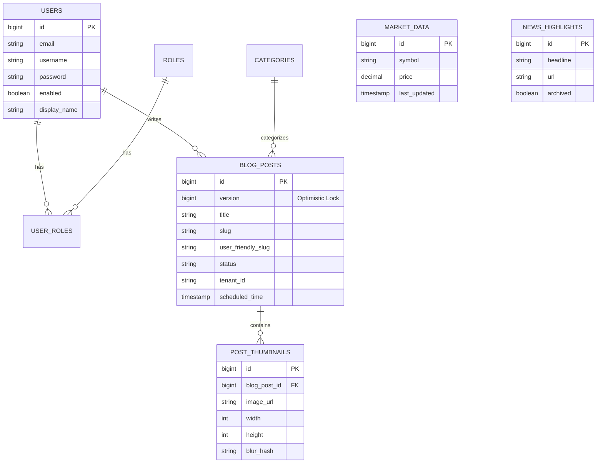

# Database Schema & Data Model

**Stable Version:** `tfin-financeapi-Develop.0.0.0.1`

The Treishvaam Finance Platform uses **MariaDB 10.6** as its primary relational data store. Schema evolution is strictly managed via **Liquibase**, ensuring deterministic deployments across Development, Staging, and Production environments.

## 1. Schema Management Strategy
* **Tool**: Liquibase
* **Master File**: `src/main/resources/db/changelog/db.changelog-master.xml`
* **Format**: XML-based changelogs.
* **Execution**: Applied automatically on application startup via the Spring Boot `LiquibaseAutoConfiguration`.

### Changelog History (Recent)
| Version | Description |
| ------- | ----------- |
| V41     | Add `display_name` column to `users` (nullable, VARCHAR(255)). Sets default for existing records. |
| V40     | Add `version` to `blog_posts` for optimistic locking. |
| V39     | Add `description` to `news`. |
| ...     | ... |

## 2. Entity Relationship Diagram (ERD)

## 3. Detailed Table Reference

### 3.1. Identity & Access Management
* **`users`**: Stores system operators and content creators.
    * Columns: `id`, `username`, `email`, `password` (hashed), `enabled`, `display_name`, `linkedin_access_token`.
* **`roles`**: RBAC definitions (e.g., `ROLE_ADMIN`, `ROLE_EDITOR`).
    * Columns: `id`, `name`.
* **`user_roles`**: Many-to-Many link table.
    * Columns: `user_id`, `role_id`.

### 3.2. Content Management System (CMS)
* **`blog_posts`**: The central content table.
    * **Core**: `title`, `content` (LONGTEXT), `slug`, `user_friendly_slug`, `status` (DRAFT/PUBLISHED).
    * **Concurrency**: `version` (BIGINT) - Used for JPA Optimistic Locking to prevent lost updates.
    * **SEO**: `meta_description`, `keywords`, `canonical_url`, `seo_title`.
    * **Editorial**: `display_section`, `review_status`, `featured` (BOOLEAN).
    * **Context**: `tenant_id`, `author`, `category_id` (FK to categories).
    * **Automation**: `url_article_id` (Unique Article Identifier for routing).
* **`categories`**: Content classification.
    * Columns: `id`, `name`, `slug`, `description`.
* **`post_thumbnails`**: Media assets linked to posts.
    * Columns: `id`, `blog_post_id` (FK), `image_url`, `alt_text`, `display_order`.
    * **Metadata**: `width`, `height`, `mime_type`, `blur_hash` (Used for "blur-up" loading on Frontend).
* **`page_content`**: Dynamic text for static pages (e.g., 'About Us', 'Vision').
    * Columns: `id`, `page_identifier`, `content_json`.

### 3.3. Financial Data Engine
* **`market_data`**: Snapshot data for symbols (Indices, Stocks).
    * Columns: `id`, `symbol`, `price`, `change_percent`, `day_high`, `day_low`.
* **`quote_data`**: Real-time quotes typically fetched from high-frequency providers.
    * Columns: `symbol`, `price`, `volume`, `timestamp`, `market_cap`, `pe_ratio`.
* **`historical_price`**: OHLC (Open-High-Low-Close) data for charting.
    * Columns: `id`, `symbol`, `date`, `open`, `high`, `low`, `close`, `volume`.
* **`historical_data_cache`**: Tracks fetch requests to prevent API quota abuse.
    * Columns: `symbol`, `start_date`, `end_date`, `last_fetched_at`.

---

*This document is auto-synchronized with the codebase as of January 2026.*