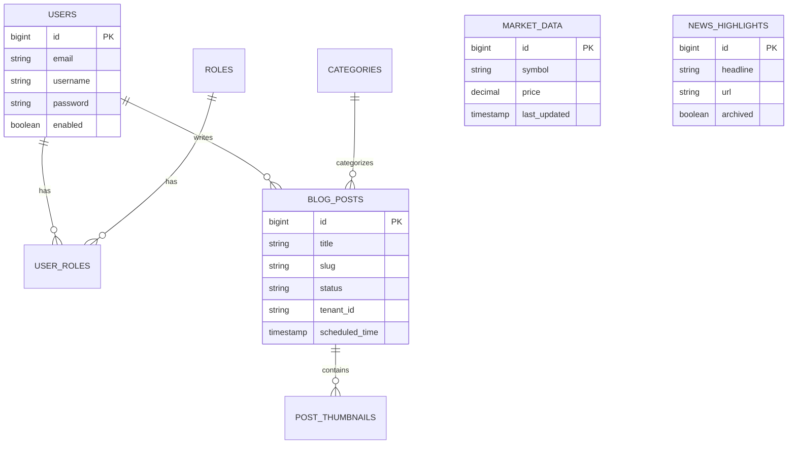

# Database Schema & Data Model

The Treishvaam Finance Platform uses **MariaDB 10.6** as its primary relational data store. Schema evolution is strictly managed via **Liquibase**, ensuring deterministic deployments across Development, Staging, and Production environments.

## 1. Schema Management Strategy
* **Tool**: Liquibase
* **Master File**: `src/main/resources/db/changelog/db.changelog-master.xml`
* **Format**: XML-based changelogs.
* **Execution**: Applied automatically on application startup via the Spring Boot `LiquibaseAutoConfiguration`.

## 2. Entity Relationship Diagram (ERD)

## 3. Detailed Table Reference

### 3.1. Identity & Access Management
* **`users`**: Stores system operators and content creators.
    * Columns: `id`, `username`, `email`, `password` (hashed), `enabled`, `linkedin_access_token`.
* **`roles`**: RBAC definitions (e.g., `ROLE_ADMIN`, `ROLE_EDITOR`).
    * Columns: `id`, `name`.
* **`user_roles`**: Many-to-Many link table.
    * Columns: `user_id`, `role_id`.

### 3.2. Content Management System (CMS)
* **`blog_posts`**: The central content table.
    * **Core**: `title`, `content` (LONGTEXT), `slug`, `user_friendly_slug`, `status` (DRAFT/PUBLISHED).
    * **SEO**: `meta_description`, `keywords`, `canonical_url`, `seo_title`.
    * **Editorial**: `editor_notes`, `review_status`, `archived`.
    * **Context**: `tenant_id`, `author_id` (FK to users), `category_id` (FK to categories).
* **`categories`**: Content classification.
    * Columns: `id`, `name`, `slug`, `description`.
* **`post_thumbnails`**: Media assets linked to posts.
    * Columns: `id`, `post_id`, `image_url`, `size` (SMALL/MEDIUM/LARGE), `metadata` (JSON).
* **`page_content`**: Dynamic text for static pages (e.g., 'About Us', 'Vision').
    * Columns: `id`, `page_identifier`, `content_json`.

### 3.3. Financial Data Engine
* **`market_data`**: Snapshot data for symbols (Indices, Stocks).
    * Columns: `id`, `symbol`, `price`, `change_percent`, `day_high`, `day_low`.
* **`quote_data`**: Real-time quotes typically fetched from high-frequency providers.
    * Columns: `symbol`, `price`, `volume`, `timestamp`.
* **`historical_price`**: OHLC (Open-High-Low-Close) data for charting.
    * Columns: `id`, `symbol`, `date`, `open`, `high`, `low`, `close`, `volume`.
* **`historical_data_cache`**: Tracks fetch requests to prevent API quota abuse.
    * Columns: `symbol`, `start_date`, `end_date`, `last_fetched_at`.
* **`market_holidays`**: Calendar of market non-trading days.
    * Columns: `date`, `exchange`, `reason`.

### 3.4. Intelligence & News
* **`news_highlights`**: Aggregated financial news items.
    * Columns: `id`, `headline`, `summary`, `url`, `image_url`, `source`, `published_at`, `archived`.

### 3.5. System & Analytics
* **`audit_logs`**: Security and compliance trail.
    * Columns: `id`, `action`, `actor`, `entity_id`, `entity_type`, `timestamp`, `ip_address`.
* **`audience_visits`**: Web analytics data.
    * Columns: `id`, `page_path`, `user_agent`, `visit_time`, `ip_hash`.
* **`contact_messages`**: Inbound user queries.
    * Columns: `id`, `name`, `email`, `subject`, `message`, `created_at`.
* **`api_fetch_status`**: Operational health of external integrations.
    * Columns: `id`, `provider_name`, `status`, `last_success`, `error_message`.

## 4. Changelog History (Key Migrations)

| ID | Description |
| :--- | :--- |
| **V1** | Initial schema creation. |
| **V11** | Added `market_data` table. |
| **V14** | Introduced `user_friendly_slug` for better SEO. |
| **V21** | Added `historical_data_cache` for Smart Sync logic. |
| **V26** | Created `audience_visits` for analytics ingestion. |
| **V30** | Added `api_fetch_status` for monitoring external quotas. |
| **V36** | Added `audit_logs` for security compliance. |
| **V38** | Added `archived` flag to `news_highlights`. |
| **V39** | Added `description` field to `news_highlights`. |

## 5. Indexes & Performance
* **Slugs**: Unique indexes on `blog_posts(slug)` and `blog_posts(user_friendly_slug)` for fast lookup.
* **Market Data**: Indexed by `symbol` and `date` in `historical_price` for rapid chart rendering.
* **Search**: While full-text search is offloaded to Elasticsearch, standard DB indexes exist on `title` and `category_id`.