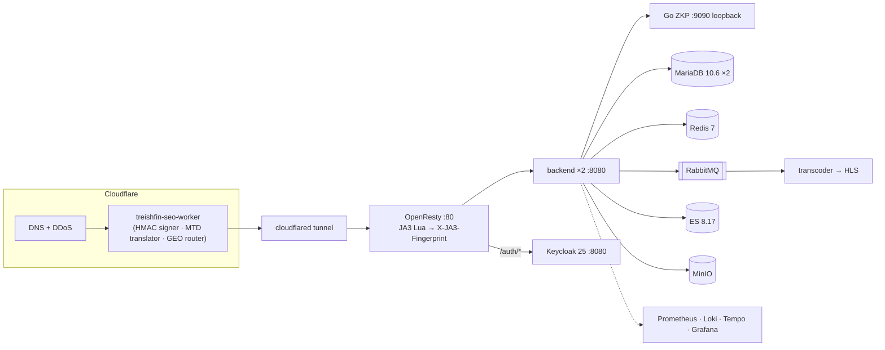
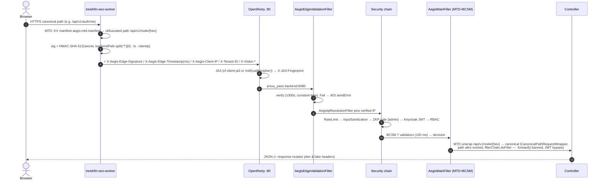

# BE-01 — ARCHITECTURE: Treishvaam `finance-api`

> **Verification basis:** backend source export (Parts 1–12) · Knowledge Tracker VOL 1+2 (incidents 1–141) · frontend repo cross-check. Supersedes legacy BE-01 + BE-04-SERVICES (absorbed).

---

## 1. Architectural Philosophy

Edge-first, decoupled zero-trust. The browser **never** talks to the backend directly — every `/api/**` request traverses the Cloudflare Worker (`treishfin-seo-worker`), which signs it (HMAC-SHA-512), translates MTD paths, and injects tenant/geo headers. The backend is a **modular monolith** with three satellite processes:

1. **Go ZKP verifier** (`aegis/zkp-service`) — gRPC `127.0.0.1:9090`, single-stage `golang:1.26-alpine` build (multi-stage permanently banned after Exit-Code-2 OOM panic — Incident 3), `cpus: 0.50`, 256 MB.
2. **Python transcoder** (`transcoder/`) — Alpine + pika listener on `video.transcode.queue`, ffmpeg `nice -n 19` → single 1080p HLS rendition (`ENABLE_4K_TRANSCODING=false` default, Infisical toggle), <15 MB idle, 384 MB / 0.5 CPU.
3. **Python market updater** (`scripts/market_data_updater.py`) — spawned in-process via `ProcessBuilder("python3", …)` on `MARKET_UPDATE` messages; yfinance (34 tickers: indices, commodities, FX, crypto-INR) upserting directly to MariaDB.

## 2. Runtime Topology (24 services, `docker-compose.yml`)

| Group | Services |
|---|---|
| Data | `treishvaam-db` (mariadb:10.6), `keycloak-db` (mariadb:10.6), `treishvaam-redis` (redis:7-alpine, dangerous cmds renamed `""`), `redis` (canary isolate), `minio` |
| Heavy | `elasticsearch` (8.17.0, 192 m heap), `rabbitmq` (3.12-management, mgmt UI `127.0.0.1:15672`), `wazuh-manager` (4.14.5) |
| Security | `aegis-zkp-service` (**127.0.0.1:9090**), `aegis-canary-server` (thinkst/canarytokens + isolated redis), `wazuh-agent` (privileged, `pid: host`) |
| Edge/agents | `tunnel` (cloudflared, token-based), `backup-service`, `permission-fixer` (one-shot chown, always alone — Golden Rule 7) |
| Observability | `promtail`, `prometheus`, `tempo`, `grafana` (`127.0.0.1:3001`) |
| App | `backend` (**×2 replicas**, JVM `-Xmx256m -Xms256m` via `JAVA_TOOL_OPTIONS`, host-mounted `backend-app.war`, healthcheck python3 socket :8080, **`start_period 240s`** — raised from 160 s after the V50 boot-hang, Incident 96–104), `treishvaam-transcoder` |
| Edge listener | `nginx` (openresty:alpine, **host 80:80/443:443 but `listen 80` only** — TLS ends at Cloudflare) |
| Experimental | `envoy-sidecar` (v1.29, `:9901` `/api/v1` router — **not in the request path**) |

Network **`treish_net` (bridge)**; volumes `app_logs`, `app_uploads`, `app_sitemaps`; devices `/dev/random`, `/dev/urandom` mounted to backend. Docker bridge is `172.18.0.0/16` — the reason `X-Real-IP`/`X-Aegis-Client-IP` extraction matters (raw `getRemoteAddr()` returns `172.18.0.x` → fingerprint collisions, Incidents 63–74).

## 3. Request Lifecycle (public API request)

## 4. Module Map

`com.treishvaam.financeapi` — entry points `FinanceApiApplication` (**centralized `@EntityScan(basePackages="com.treishvaam.financeapi")`** + `@EnableJpaRepositories` over 7 domain packages — localized `@EntityScan` configs banned after the 18-entity blindness incident 105–111), `ServletInitializer`. Packages: `config` (+`config.tenant`), `security` (+`security.aegis.{ael,bcsm,crypto,mtd}`), `controller`, `dto`, `model`, `repository`, `service`, `marketdata`, `analytics`, `apistatus`, `newshighlight`, `userpreferences`, `search`, `aspect`, `exception`, `common`. Legacy ns `com.treishvaam.finance` holds `messaging/` (EventMessage, MessagePublisher/Listener) + `dto/ShareRequest`.

## 5. Filter Chain Architecture

**Servlet chain (registration order):**

| Order | Filter | Registration |
|---|---|---|
| `HIGHEST_PRECEDENCE` | `AegisEdgeValidationFilter` | FilterRegistrationBean |
| `HP+1` ⚠ tie | `AegisIpResolutionFilter` · `RequestIdFilter` · `AegisMainFilter` · `AegisZkpAdminFilter` | mixed |
| `HP+2` ⚠ tie | `CorsFilter` · `InputSanitizationFilter` · `AegisResponseMutator` | mixed |
| `-105` | `AegisDeceptionFilter` | `@Component` |
| `-100` | `springSecurityFilterChain` | Spring default |

**Security chain (SecurityConfig, canonical intent):** Deception → Main → InternalSecret → RateLimiting → InputSanitization → ZkpAdmin → (UsernamePassword anchor) → OAuth2 JWT → authorization. `FilterConfig` disables auto-registration only for `InternalSecretFilter` + `RateLimitingFilter`. ⚠ Sub-tie order is container-dependent (OP-08).

## 6. Threading & Concurrency

- **Explicit virtual threads (real, code-verified):** `TarpitManager`, `CloudflareEdgeSyncService`, `AegisBcsm` (per-evaluation executor), `MerkleAuditLogService`, `ImageService` variant fan-out, analytics roll-ups (`@Async @EventListener(ApplicationReadyEvent) initAfterBoot()` — replaced `@PostConstruct`, which deadlocked port binding, Incident 96–104).
- **Platform threads:** `AsyncConfig` pool (5/10/25, `ContextCopyingDecorator` propagates TenantContext + MDC); Tomcat — `spring.threads.virtual.enabled` is **never set** (OP-06). Knowledge Tracker asserts virtual-thread usage; true only for the explicit executors above.
- Concurrency guards: `synchronized(ImageService.class)` around Thumbnailator (JDK `FileCacheImageOutputStream.seek()` corruption under concurrent virtual-thread writes — Incident 121).

## 7. Multi-Tenancy

`TenantContext` (`InheritableThreadLocal`, default `public`, whitelist `finance|agro`) · `TenantInterceptor` (`X-Tenant-ID`, MDC `tenantId`, clear in `afterCompletion`) — ⚠ no MVC registration found (OP-07); the Worker injects `X-Tenant-ID: finance` unconditionally and `DataInitializer`/`MarketDataInitializer` set it programmatically. `BlogPost` carries a Hibernate `@Filter(tenant_id)`; sitemap/GEO generation branches per tenant domain.

## 8. Services Layer (deep dive — absorbed from legacy BE-04-SERVICES, code-verified)

### 8.1 Content pipeline (`BlogPostServiceImpl`)
- IDs: internal `slug` = SecureRandom 8-byte Base64URL; `userFriendlySlug` from title; `urlArticleId` = `EEEddMMyyyyHHmm` UTC + id, lowercased.
- `createDraft`/`updateDraft` — optimistic `version` check → `ObjectOptimisticLockingFailureException` → **409**.
- `save(...)` — cover image → `ImageService`; thumbnails (new files matched by originalFilename, else reuse-by-URL); `persistPost` (SCHEDULED if future `scheduledTime` else PUBLISHED; `content_signature` HMAC on publish; second save for `urlArticleId`); async `HtmlMaterializerService` (fetch Next.js shell from `treishvaam-nginx`, Jsoup-inject SEO/JSON-LD/`#server-content`/`window.__PRELOADED_STATE__`, upload `posts/{slug}.html` to MinIO, `max-age=3600`); RabbitMQ `event.search` (PUBLISHED only) + `event.sitemap`; optional LinkedIn `/v2/ugcPosts` (disabled when token empty).
- Scheduler `@Scheduled(fixedRate=60000)` flips due SCHEDULED→PUBLISHED.
- Deletes evict `BLOG_POST_CACHE` allEntries + emit DELETE search events.
- **Cache rule (immutable):** no `@Cacheable` on `Optional<T>` finders (Redis deserialization crash).
- `VideoService.processVideoUpload` — `@RequestParam("videoFile") MultipartFile` → `java.nio.file.Files` write to `/app/uploads/raw/{postId}.mp4` (shared volume) → `MessagePublisher` `{"videoId":"…"}` to `video.transcode.queue`. (Extracted from BlogPostServiceImpl for SRP — Incident 123.)

### 8.2 Market engine (`marketdata`)
- **Provider strategy** (interface: `fetchTopGainers/Losers/MostActive/fetchHistoricalData`): **FMP ACTIVE** (`financialmodelingprep.com/stable`, movers); **AlphaVantage** legacy-historical only (⚠ malformed base URL `https.www.…`, OP-15); **Finnhub** disabled (`UnsupportedOperationException`); **Breeze** unimplemented (IN-market placeholder); **YahooHistoricalProvider** CSV 20-year window, UA-spoofed, keyless.
- `MarketDataFactory`: movers = IN→Breeze else FMP; historical→AlphaVantage; quote→Finnhub.
- Crons: movers `0 0 22 * * MON-FRI UTC`; global refresh `0 0 */4 * * *` → `enqueueMarketUpdate` → RabbitMQ `internal.queue` → `MarketUpdateConsumer` → python updater (deliberate async — ProcessBuilder under request threads starved Hikari, ARCH-03).
- Circuit breakers: `fmpApi` (window 20, wait 30 s, TL 5 s), `pythonScript` (window 10, wait 60 s, TL 120 s, fallback SKIPPED status).
- `MarketDataRepository.deleteByType` = `@Modifying` JPQL delete (fixes optimistic-lock crash on mover refresh — Incident 17).
- Caches: `marketWidget` 5 min, `quotesBatch` 5 min; `HistoricalDataCache` 30-min freshness.
- News (`NewsHighlightService`): 15-min cron → newsdata.io business/en, 18-source whitelist, link+title dedupe, keeps 50 active, og:image healing via Jsoup.

### 8.3 Analytics engine (`analytics`)
- Two-pipeline split: **Grafana Faro web-vitals → `MonitoringController`** (YAUAA enrichment → `audience_visits`, async forward `http://alloy:12347/collect`) vs **first-party AEGIS events → `AnalyticsEventController`** (`analytics_events`). ⚠ current frontend posts Faro to `NEXT_PUBLIC_FARO_URL` (default `/faro/collect`), not `/monitoring/ingest` (OP-20).
- `syncAegisTelemetryToAudienceVisits()` — `@Scheduled(fixedDelay=300000)` bridge (5 min, 7-day lookback, `Asia/Kolkata` day boundary, 500-row `TransactionTemplate` chunks).
- GA4 Data API daily 02:00 + `ga4.bigquery.enabled=false` (free-tier mandate); Smart Attribution maps GA4 onto Faro rows (placeholder rows `sessionId="Not available (GA4)"`).
- `AudienceVisitRepository extends JpaSpecificationExecutor` + dynamic CriteriaBuilder specs (monolithic `(? IS NULL …)` JPQL deleted — Hibernate 6 + MariaDB typed-NULL incompatibility, Incidents 33/76/77); `sanitizeParam` `""`→`null`.
- Healer `healHistoricalDataFidelity()` — ZKP-gated, `PageRequest.of(page,500)` + `entityManager.clear()` (~20 MB heap cap), per-chunk commits.
- `hydrateOrphanedAudienceFingerprints()` — synthetic `syn-{sha3}` fingerprints for 3,648 legacy GA4 rows.
- Retention purge daily 03:30 (>365 d, DPDP).

### 8.4 Media & SEO services
- `ImageService` — Tika MIME gate; 4 WebP variants (1920/1200/800/480, quality matrix STANDARD vs NEWS) + BlurHash 4×3; parallel on virtual threads under `synchronized` guard.
- `FileStorageService` — MinIO `UUID.ext`; presigned GET **7 days**; HTML uploads `Cache-Control: public, max-age=3600`.
- `SitemapService` — 10,000-URL chunks; tenant domain base; page-0 prepends `/llms.txt`, `/ai-feed.md`, `/ontology.json` (daily, 1.0); news sitemap = last 48 h posts; regeneration lazy after `event.sitemap` eviction.
- `GeoOptimizationService` — `llms.txt` / `ontology.json` / `ai-feed.md` (top-10 posts, `<semantic-chunk>` boundaries), HMAC-SHA256 provenance (`CONTENT_SIGNING_KEY`), `max-age=3600`.
- `editorialDistributor.js` (frontend) — exponential temporal decay `weight = baseWeight · e^(−λt)` for homepage layout.

## 9. Configuration Profiles

| Concern | dev (port 8081) | prod (port 8080) |
|---|---|---|
| DB | `jdbc:mariadb://localhost:3306/finance_db`, `ddl-auto=update`, show-sql | `${PROD_DB_URL}`, **`validate`**, Hikari 50 |
| Swagger / actuator | on / `include=*`, always | **off** / `health,prometheus`, `when-authorized` ROLE_ADMIN |
| Tracing / JSON logs | — | sampling 0.1 → `tempo:9411`; `/app/logs/backend.json` |
| Keycloak issuer | absent (OP note) | `${…JWT_ISSUER_URI}` + jwk-set-uri |

## 10. Open Items (⚠)

OP-06 virtual-thread property · OP-07 tenant interceptor · OP-08 filter ties (all in BE-00 §4) · Envoy sidecar purpose (retention decision) · compose `deploy.replicas` inert under plain compose (Engine B scales manually).
