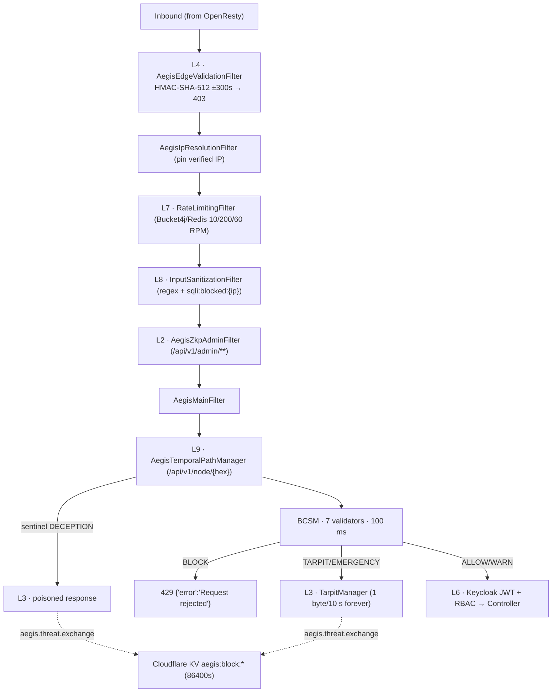

# BE-02 — SECURITY: The AEGIS 9-Layer Zero-Trust Framework

> **Verification basis:** backend source (Parts 1–12) · Knowledge Tracker VOL 1+2 · SKILLS REF_2 cross-check. Supersedes legacy BE-02-CORE + BE-07-SECURITY. Implementation-status caveats are explicit — this is the honest picture.

---

## 1. Framework Overview



| Layer | Name | Components | Status |
|---|---|---|---|
| L1 | PQC (Dilithium5 / ML-DSA-87) | `AegisPqcJwtService`, `AegisPqcKeyStore` | Implemented (in-memory keys) |
| L2 | ZKP admin gating | `AegisZkpAdminFilter`, `AegisZkpServiceClient`, Go service | Wired; **verifier = accepting stub** ⚠ |
| L3 | Active deception & tarpitting | `AegisDeceptionEngine/Filter`, `TarpitManager`, `PoisonCorpusGenerator`, `CanaryTokenService` | Implemented |
| L4 | Edge HMAC validation | `AegisEdgeValidationFilter` + Worker | Implemented |
| L5 | Entropy & behavioral | `ShannonEntropyCalculator`, `AegisBehavioralEngine`, `AegisJwtEnhancer` | Partial — **entropy threshold unwired** ⚠ |
| L6 | JWT + RBAC | SecurityConfig, `KeycloakRealmRoleConverter` | Implemented |
| L7 | Distributed rate limiting | `RateLimitingFilter`, `Bucket4jConfig` | Implemented |
| L8 | Sanitization & integrity | `InputSanitizationFilter`, `QuerySanitizationService`, `AegisQueryInterceptor`, `ContentIntegrityService` | Implemented |
| L9 | Moving Target Defense | `AegisTemporalPathManager`, `CloudflareEdgeSyncService`, `AegisResponseMutator` | Implemented |

## 2. Route Security Matrix (`SecurityConfig`)

Stateless: `csrf().disable()`, `SessionCreationPolicy.STATELESS`, `frameOptions.disable()`, OAuth2 JWT with `KeycloakRealmRoleConverter`. CORS disabled in-chain; global `CorsFilter` bean (HIGHEST+2) — allowed headers include the full AEGIS set (`X-AEGIS-ZKP-Proof`, `X-AEGIS-Challenge-ID`, `X-Aegis-Biometric-Hash/Raw`, `X-Aegis-Edge-Signature/Timestamp/Client-IP`, `X-CSRF-Token`); exposed `X-AEGIS-POW-Challenge`.

| Matcher | Rule |
|---|---|
| `OPTIONS /**` | permitAll |
| `/actuator/health`, `/api/v1/health/**`, `/api/v1/monitoring/ingest`, `/error` | permitAll |
| `/actuator/**` | ROLE_ADMIN |
| GET `/api/v1/uploads/**`, `/sitemap*.xml`, `/feed.xml`, `/sitemaps/**`, `/favicon.ico`, `/llms.txt`, `/ai-feed.md`, `/api/public/**` | permitAll |
| GET `/api/v1/{posts,categories,market,news,search}/**`, `/api/v1/logo` | permitAll |
| POST `/api/v1/market/quotes/batch`, `/api/v1/analytics`, `/api/v1/analytics/event`, `/api/v1/analytics/**`, `/api/v1/aegis/telemetry` | permitAll |
| `/api/v1/contact/**` | permitAll |
| POST/PUT `/api/v1/posts/draft…` | authenticated |
| `/api/v1/auth/**` | authenticated |
| GET `/api/v1/analytics` (dashboard) | ANALYST/ADMIN (method-level ADMIN on refresh) |
| `/api/v1/posts/admin/**` | EDITOR/PUBLISHER/ADMIN |
| POST `/api/v1/posts` | PUBLISHER/ADMIN |
| PUT `/api/v1/posts/**` | EDITOR/PUBLISHER/ADMIN |
| DELETE `/api/v1/posts/**` | PUBLISHER/ADMIN |
| `/api/v1/files/upload` | PUBLISHER/ADMIN |
| `/api/v1/admin/**`, `/api/v1/status/**` | ROLE_ADMIN **+ ZKP filter** |
| fallback | `anyRequest().authenticated()` |

Keycloak realm roles: `admin`, `editor`, `publisher`, `analyst` (frontend UI checks only `admin|publisher`). ⚠ No `.exceptionHandling()` configured. Note: `/api/v1/analytics/event` permitAll was added 2026-07-15 (Incident 11) to unblock sendBeacon.

## 3. Layer 2 — ZKP Admin Gating (honest picture)

- Filter intercepts `/api/v1/admin/` prefix. Bypass ladder: `X-AEGIS-Test-Token: true` (CI only) → heal special-case: exact URI `/api/v1/admin/actions/analytics/heal` accepts header **`X-AEGIS-ZKP`** = `app.security.internal-secret` *or* `verifyProof("system_admin","ANALYTICS_HEAL_ACTION", value)` → standard contract: **`X-AEGIS-ZKP-Proof` + `X-AEGIS-Challenge-ID`** via client. (Scoped-bypass design verified working 2026-08-05/07, Incidents 37–45; the global-bypass variant was **rejected** as an L3-ZKA violation. Controller-level ZKP was removed — Incident 45 — the gate lives in the filter.)
- Client: gRPC `ManagedChannelBuilder.forTarget("${aegis.zkp.target:aegis-zkp-service:9090}").usePlaintext()`, blocking stub, `@CircuitBreaker(name="zkpService")` fallback returns `false` (**fail-closed**). `verifyProof(String,String,String)` — 3-arg signature (Incident 40).
- Failures → 403 JSON (`Zero-Knowledge Proof required…` / `Cryptographic identity proof invalid or expired.`).
- ⚠ **Go verifier is an accepting stub** (`VerifyLatticeSchnorrProof` = length check; challenge ignored; gnark `SchnorrLatticeCircuit` scaffolding; MiMC challenge-binding no-op). Effective L2 = JWT ROLE_ADMIN + header presence. Loopback-only port binding + internal DNS mitigate exposure. ⚠ `extractAdminIdFallback` returns a stub string.

## 4. Layers 3–5 — Deception, Entropy, Behavioral

### 4.1 L3 Deception
- Triggers: `HONEYPOT_PATHS (?i)^/(\.env|wp-admin|phpmyadmin|config\.php|\.git|vendor/phpunit).*`; `MALICIOUS_PAYLOADS (?i)(UNION\s+SELECT|script>|\.\./\.\./|base64_decode\()` on the query string → `publishAttackEvent(ip, ja3, path, "Deception Filter Intercept")` + strategy response.
- Strategies: `.env`/`config.php` → 200 fake env (canary-bearing); `wp-admin`/`phpmyadmin`/`vendor` → 301 self-redirect loop `?d={n+1}&t={canary}`; `api/` → 200 fake JWT; default → slow-leak tarpit.
- Tarpit: 200 `text/html`, keep-alive, virtual thread writes `"\n"` then **1 byte / 10 000 ms forever**. ⚠ The Worker rewrites tarpitted IPs to `/api/v1/aegis/tarpit/trap` — **no backend handler exists for that path** (OP-05).
- Canary: `AKIA` + 16 hex; Thinkst server + isolated Redis as siblings (canary env quirks: strict `CANARY_` prefix incl. `CANARY_WG_PRIVATE_KEY_SEED`, dual `switchboard.env`/`frontend.env`, `rm -f twistd.pid`).

### 4.2 Behavioral
- Score: missing/UNKNOWN JA3 **+40**; JA3 strikes >5 **+60**; missing biometric **+30**; cap 100. Strikes in-memory `ConcurrentHashMap` (Redis sync = future work). `AegisJwtEnhancer`: risk ≥ **80** → token unsafe.
- **AI-crawler bypass:** UA ∈ {GPTBot, ClaudeBot, Google-Extended, anthropic-ai, PerplexityBot, Googlebot} **and** rDNS under `.googlebot.com` / `.search.msn.com` / `.outbound-enterprise.openai.com` / `.anthropic.com` → score 0.
- ⚠ `SessionBehaviorProfile` = dead code.

### 4.3 Entropy (⚠ partially unwired)
- `ShannonEntropyCalculator` — pure static function; **no threshold (7.2 or any) is referenced in code**; nothing routes on entropy (OP-02).
- Implemented: `AegisEntropyManager` — 512-byte pool, refresh every 30 s (`/dev/random` + `/dev/urandom` + JVM), SHA3-512 digest XOR-folded over the pool (forward-secrecy fix — never replace pool with digest); `getSecureRandom()` seeds from a random 64-byte window. Sources: `CPU_JITTER` (1000-iter `Math.sin` timing), `OS_URANDOM`.
- `PowChallengeIssuer`: difficulty **24 leading zero bits** (6 hex zeros of SHA3-256), challenge `v1:{difficulty}:{epochMillis}:{nonce}` in `X-AEGIS-POW-Challenge` with **202** `{"status":"processing",…}`; ⚠ no server-side expiry check.

## 5. Layer 4 — Edge HMAC Contract (canonical)

```text
key       = AEGIS_EDGE_SECRET (64-char; Worker secret ↔ Infisical AEGIS_EDGE_SECRET must match)
data      = "${pathname}:${timestamp}:${clientIp}"   // pathname = exact BACKEND path (post-MTD),
                                                      // query string stripped (worker .split('?')[0])
headers   = X-Aegis-Edge-Signature (hex) · X-Aegis-Edge-Timestamp (epoch ms) · X-Aegis-Client-IP
drift     = ±300 s (ms compare, MAX_TIME_DRIFT_SECONDS = 300)
failure   = HTTP 403 sendError — "Origin Access Denied - …" / "- Malformed Timestamp" / "- Payload Expired" / "- Invalid Cryptographic Signature"
compare   = constant-time (MessageDigest.isEqual)
bypass    = (loopback | ::1 | 10.* | 192.168.* | 172.*) AND (/actuator* | /health*)   // nothing else
```

- IP resolution: `X-Aegis-Client-IP` → `CF-Connecting-IP` → `X-Real-IP` → `remoteAddr`; `AegisIpResolutionFilter` pins the verified value into all forwarding headers — **spoofed `X-Forwarded-For` never reaches controllers**. IP source must never be raw `getRemoteAddr()` (Docker bridge `172.18.0.x` → fingerprint collisions — Incidents 63–74).
- SSR nuance: Next.js server components sign with `clientIp='127.0.0.1'` (3-part, valid). ⚠ The frontend app-route proxies (`app/llms.txt` etc.) sign 2-part (`path:timestamp`) and send `X-Aegis-Timestamp` — **they will 403** (OP-18).
- Nginx JA3: `cf-client-ja3` passthrough else pseudo-hash `md5(ua|ssl_protocol|ssl_cipher)` → `X-JA3-Fingerprint`.

## 6. BCSM — Byzantine Consensus Security Mesh

7 validators on a per-call virtual-thread executor, **100 ms timeout** each; exception/timeout → `WARN(50, NODE_FAILURE/TIMEOUT_NODE)`; executor failure → **BLOCK** (fail-closed). Consensus: ≥2 EMERGENCY → EMERGENCY (tarpit); ≥3 BLOCK votes (or score>70) → BLOCK (→ **429** `{"error":"Request rejected"}`); avg>50 → DECEPTION; avg>30 → WARN; else ALLOW. Enum: `ALLOW WARN BLOCK DECEPTION TARPIT EMERGENCY`.

| Validator | Reality |
|---|---|
| Behavioral | Real (risk model §4.2) |
| Jwt | Real (`AegisPqcJwtService.validateToken`; forged → 100/BLOCK; absent → ALLOW public) |
| RateLimit | Real read-only (`RATE_LIMIT_EXHAUSTED` attr → 85/BLOCK) |
| TemporalPath | Real (`AEGIS_TEMPORAL_VALID`; `/sitemaps*`, `/` exempt) |
| Deception | ⚠ Stub (header `X-AEGIS-Trap-Flag` only; Redis `aegis:deception:score:<ip>` unimplemented) |
| EntropyHealth | ⚠ Stub (constant 0/ALLOW) |
| HidsIntegrity | ⚠ Stub (constant 0/ALLOW — Wazuh bridge future) |

`MerkleAuditLogService` — SHA3-256 leaves over top-1000 audit rows every 5 min; ⚠ root only logged (OP-04).
**AEL** (ANTLR4 `aegis.g4`): `POLICY id { <condition> THEN <action> ELSE <action> }`; domains `BEHAVIOR/CRYPTO/NETWORK/TIME/SCORE`; actions `ALLOW · BLOCK("r") · DECEPTION · TARPIT(Nms) · ROTATE_MANIFEST · EMERGENCY · LOG("m") · CHALLENGE(ZKP|POW|CAPTCHA)`; `BailErrorStrategy` — bad rules fail startup.

## 7. Layers 7–9

### 7.1 L7 Rate limiting
Dedicated Lettuce client (`RedisURI.create(System.getenv("SPRING_DATA_REDIS_URL"))` — `@Value` shadowing banned after NOAUTH lockout, Incident 7). Key `clientIp:category`; `/auth/` 10 RPM · GET 200 RPM · else 60 RPM; 429 `{"error":"Rate limit exceeded. Try again in 60 seconds."}`; Redis failure → **503 fail-closed**. Nginx adds `keycloak_auth` 20 r/m burst 15 on `/auth/`; `api_write`/`api_read` zones declared but unapplied.

### 7.2 L8 Sanitization & integrity
- `InputSanitizationFilter` — query/form params through 4 regex families (SQL keywords incl. `xp_|sp_`; **chained-SQLi** `;\s*(drop|alter|create|truncate|…)` — refined 2026-08-16 after Tiptap `width: 50%;` false positives; quote escapes; boolean tautologies). Hit → 400 `{"error":"Invalid input detected. Request blocked."}` + Redis **`sqli:blocked:{ip}` TTL 1 h** (flush: `redis-cli KEYS "sqli:blocked:*" | xargs -r redis-cli DEL`).
- `AegisQueryInterceptor` — Hibernate `StatementInspector` **signs** SQL (SHA3-256 → HmacSHA256 `aegis.db.signing.key` → `/* AEGIS_HMAC:{hex} */`); never blocks, fails open. Changing the key invalidates prior signatures.
- `ContentIntegrityService` — HmacSHA256(`CONTENT_SIGNING_KEY`) over `title|slug|content|author|tenantId` → `content_signature` (VARCHAR 128); missing key → disabled (fail-open); ⚠ verdict computed on read, not enforced.

### 7.3 L9 MTD
- Targets `/api/v1/{admin,auth,users,dashboard,analytics}` → `/api/v1/node/{8-hex}` (hex from entropy pool). Manifest `{"paths":{…},"issuedAt":…}` → Redis **`aegis:mtd:manifest` TTL 24 h**; rotation via `setIfAbsent` lock **`aegis:mtd:lock` 30 s** (split-brain fix 2026-08-03, Incidents 29–30 — replicas had booted independent manifests); PQC-signed + pushed to KV `aegis:mtd:manifest` (no TTL).
- Rotation: `@PostConstruct` + `0 0 3 * * *` + `0 0 4 * * SUN` (keypair regen) + emergency.
- Resolution: SEO exclusions (`/sitemap.xml`, `/sitemap-dynamic`, `/market`, `/blog`, `/category`, `/api/v1/public`) → beacon exemptions (`.startsWith("/api/v1/analytics/event")`, `/api/v1/aegis/telemetry` — tightened 2026-08-01, Incident 26) → temporal match **`.equals(prefix) || .startsWith(prefix + "/")`** (base-path fix, Incident 28) → unwrap via `CanonicalPathRequestWrapper` (URI/servletPath overridden; `ServletRequestPathUtils.PATH` + `HandlerMapping.lookupPath` attributes evicted; dispatched with `filterChain.doFilter` — the `.forward()` variant bypassed the JWT chain and is banned, Incident 26) → canonical-target access returns sentinel `"DECEPTION"` → poisoned response.
- **Flow reality:** the browser calls canonical paths; the **Worker** translates to `/api/v1/node/{hex}` via the KV manifest and signs over the translated path. Direct canonical hits (origin-bypass attackers) get DECEPTION.
- `AegisResponseMutator` — 5–45 ms Gaussian jitter, fake `X-Powered-By` pool, `Server: AEGIS-M`, no-store.

## 8. Layer 1 — PQC

`AegisPqcKeyStore`: `DilithiumParameterSpec.dilithium5` (= ML-DSA-87), BouncyCastle + BouncyCastlePQC providers, entropy-pool-seeded, **in-memory keys** (restart/weekly rotation = new keypair). `issueHybridToken(innerKeycloakJwt, tenant, sid)`: header `{"alg":"ML-DSA-87","typ":"PQC-JWT"}`, payload `{sub: <full classical JWT>, tenant, sid, iat, exp: iat+3600}`, signature `Signature.getInstance("Dilithium", BouncyCastlePQCProvider)` over `header.payload`. **JJWT/Nimbus prohibited** (no FIPS 204) — manual encode/decode; **`liboqs-java` permanently excluded** (breaks CI/CD).

## 9. Threat Pipeline & Encryption at Rest

Pipeline: filters → `RabbitMQAttackPublisher` (payload `timestamp/ip/ja3/target_path/trigger`) → `aegis.threat.exchange` DIRECT rk `threat.detected` → `aegis.threat.queue` (annotation-declared; absent from `definitions.json`) → `AegisThreatConsumer` → `CloudflareEdgeSyncService` (24 h local dedup) → KV `aegis:block:{ip}` / `aegis:block:ja3:{ja3}` TTL 86400 s (Worker enforces pre-backend; TARPIT-flagged IPs routed to honeypot path — see OP-05).

At rest: MariaDB TDE (AES_CTR, `MARIADB_ENCRYPTION_KEY`, tables/log/tmp/binlog encrypted) + 5 JPA converters (`AES/GCM/NoPadding`, 12-byte IV, `"v1:"+Base64`): `users.email`, `users.linkedin_access_token`, `contact_message.email/message`, `audit_logs.ip_address` (env keys `*_ENCRYPTION_KEY`). Device fingerprints = SHA3-256(IP+UA+Accept-Language) — **raw IPs never persisted** (DPDP). `DatabaseCredentialProvider` keeps DB creds in `char[]` with zeroing.

## 10. Open Items (⚠)

OP-01 ZKP stub · OP-02 entropy unwired · OP-03 stub validators · OP-04 Merkle root unpersisted · OP-05 worker-tarpit path without backend handler · PoW no expiry · content-tamper verdict unenforced · `X-AEGIS-Test-Token` bypass must never leave CI · admin-id extraction stubbed.
