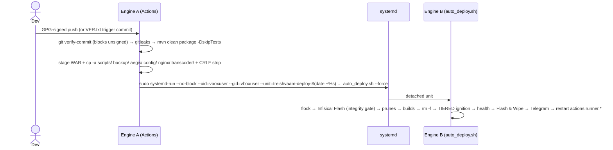

# BE-03 — DEPLOYMENT: Dual-Engine CI/CD, Operations & Incident Response

> **Verification basis:** backend source (deploy.yml, auto_deploy.sh, all scripts, compose, IaC) · Knowledge Tracker VOL 1+2 (anti-regression rules, incidents 1–141) · SKILLS REF_3 cross-check. **Re-verified line-by-line 2026-08-23** (corrections: pre-build gating, printenv claim, T4→T5 settle, OWASP non-blocking, V48 history, Terraform target, host-IP explanation — each marked inline). Supersedes legacy BE-03-DEPLOYMENT + BE-06-INFRA-DEVOPS + BE-09-DEPLOYMENT + BE-12-LOCAL-SETUP + BE-13 (pointers) + BE-14-INCIDENT-RUNBOOK — all absorbed and corrected.

---

## 1. Topology & Actors

- **Engine A — GitHub Actions** (`deploy.yml`, self-hosted runner on the production VM, triggers push `[main, staging, develop]` + dispatch + weekly schedule; concurrency `production-deployment`, `cancel-in-progress: true`).
- **Engine B — `auto_deploy.sh`**, systemd-detached. Telemetry: `/opt/treishvaam/logs/deploy_telemetry.ndjson` (zeroed by Engine A pre-handoff — stale telemetry causes false aborts) + `/opt/treishvaam/deploy_pipeline.log`; **Telegram (`@engine_b_deploy_bot`) + the log are the only deployment truth**.
- **Host:** Ubuntu VirtualBox VM (4.8 GB RAM, 850 MB swap), user `vboxuser`, root `/opt/treishvaam`. Runner TCP heartbeat is severed ~30 s into Engine B by the STP bridge flap — **an SSH disconnect during deploy is not a failure** (Rule 24).

## 2. Engine A Contract

Stages: checkout (fetch-depth 0) → **GPG verify-commit** (hard fail) → `sudo rm -f /tmp/gitleaks.tmp` → gitleaks (`gitleaks-action@v2`, no `with: args:`) → JDK 21 temurin → `./mvnw clean package -DskipTests -B` (`MAVEN_OPTS=-Xmx1024m`; `-T 1C` prohibited — OOM) → stage artifacts (`cp target/finance-api.war /opt/treishvaam/backend-app.war`; `cp -a` of the support dirs; `sed -i 's/\r$//'`) → zero telemetry file → `export RUNNER_TRACKING_ID=""` → systemd-run handoff. OWASP dependency-check runs in a separate scheduled job (`-DfailBuildOnCVSS=8`, never blocking deploys — and structurally **cannot** fail: the Maven step ends with `|| echo "⚠️ Non-critical vulnerabilities found…"` at `deploy.yml:201`, OP-25). Secrets: `NVD_API_KEY`, `GPG_PUBLIC_KEY`, `GITHUB_TOKEN`, `GITLEAKS_LICENSE`.

> [!NOTE]
> **Workflow path (verified 2026-08-23):** in this export the pipeline file sits at `github/workflows/deploy.yml` — GitHub Actions requires `.github/workflows/`. If the live repository mirrors the exported path the pipeline would never trigger; since deploys demonstrably run, the real checkout almost certainly has `.github/workflows/` and the dot was stripped during export. Verify on the real repo (OP-26).

> [!NOTE]
> **CI trigger mechanism:** GitHub path filters drop `--allow-empty` commits. The canonical trigger is `echo " " >> VER.txt` + a real commit (Incident 81, institutionalized 2026-08-10). `VER.txt` is operational, not junk.

## 3. The Docker Bridge Fatality

> [!CAUTION]
> ### `docker compose down` IS PROHIBITED ON PRODUCTION HOSTS
> It deletes the **`treish_net` bridge**; host routing + Cloudflare Tunnel coupling collapse → **permanent SSH loss** (hypervisor console required). Also banned: `docker system prune -a`, `docker image prune -a`, manual SIGKILL to `actions.runner.*`, removing `--no-block` from the systemd-run call.
>
> Safe lifecycle (what Engine B actually does): `docker compose rm -f` teardown → **tiered `docker compose up -d --no-deps`** → backend scale 1→2 after health. `docker compose stop` for halts; `docker compose restart <svc>` for singles.
> Bridge/mount recovery: `scripts/kernel-mount-recovery.sh` (stops docker.socket/containerd → lazy `umount -l /var/lib/docker/*` → purges ghost container metadata → restarts). It repairs Docker mounts/containerd state — **not** iptables.

## 4. Engine B — Execution Order

1. `flock -n 200 /tmp/treishvaam_deploy.lock`; EXIT trap restores `.env` from template **only when `OWNS_LOCK="true"`** (concurrent-push vault-wipe guard); telemetry via `jq -cn --arg` NDJSON.
2. Host tuning (NOPASSWD sudoers): `timedatectl set-ntp true` (**before** secrets — HMAC clock alignment), `vm.overcommit_memory=1`, `vm.max_map_count=262144`, IPv6 off, `drop_caches`.
3. **Infisical Flash**: `cp .env.template .env` → universal-auth login → JWT captured from stdout (`grep -oE 'eyJ…'`, stateless — no `.infisical.json`) → `infisical export --env prod >> .env` → boundary-only sed `sed -E "s/='(.*)'$/=\1/"` (global quote-strip corrupts `#`-bearing Redis passwords → NOAUTH) → **integrity gate: abort if `REDIS_PASSWORD` or `PROD_DB_PASSWORD` blank**.
4. Telegram STARTUP (tokens pulled from Infisical after export succeeds); `.env.template` stays secret-free.
5. Prunes: image prune, builder prune, ghost purge (`status=dead` + `status=created` — a `created` orphan hoards port + DNS name); fallback kernel-mount-recovery.
6. Pre-builds — **correction 2026-08-23**: only `aegis-zkp-service` is md5 change-detect gated (`auto_deploy.sh:490-498`); `backend` is built **unconditionally** every run (`:501`), exit-code validated. Both abort the deploy on build failure.
7. `docker rm -f wazuh-agent` (pid:host + S6 SIGTERM suicide-trap, Golden Rule 8) → `docker compose rm -f || true`.
8. **Tiered ignition** (15 s settle between tiers; `drop_caches` between all tiers **except T4→T5**, which is plain `sleep 15` — verified 2026-08-23):
   T1 `treishvaam-db keycloak-db treishvaam-redis redis minio` → T2 `elasticsearch rabbitmq wazuh-manager` → T3A `aegis-zkp-service aegis-canary-server` → T3B `wazuh-agent backup-service tunnel` → T3C `promtail prometheus tempo grafana` → T3.5 `permission-fixer` (alone — its I/O spike deadlocks containerd overlayfs) → T4 `backend --scale=1` + `treishvaam-transcoder` (added to Tier 4 after it was dropped, Incident 118–124) → T5 `nginx envoy-sidecar --force-recreate`.
9. Health: `docker inspect` health for db/redis/es/rabbit → `curl /actuator/health` **35 × 15 s = 525 s** (raised from 225 s after 850 MB swap thrash, Incident 89–95) → `--scale backend=2`.
10. **Flash & Wipe**: `.env` → template. Telegram SUCCESS/FAILURE. Final: `sudo -n systemctl restart actions.runner.*` (TCP half-open zombie cure — Rule 24.1).

FMEA notes: `set +x` before secret injection; CRLF is stripped inside the Infisical extraction itself (`tr -d " \"'\r"` on captured values and `sed 's/\r//g'` on the export stream — `auto_deploy.sh:394-427`; **correction 2026-08-23**: the earlier "`printenv | tr -d '\r'` for legacy containers" claim was wrong — no `printenv` appears in any script); Dockerfile consumes the **pre-built WAR** (double compilation banned); compose passwords double-quoted.

## 5. Golden Anti-Regression Rules (Tracker, verbatim intent — 13 rules)

1. Never remove `--no-block` from the `sudo systemd-run` call (runner SIGKILL cascade kills Engine B).
2. Never run an `.env`-deleting EXIT trap without the `OWNS_LOCK` gate.
3. Never poll telemetry without zeroing it first.
4. Never trust a "hung" sleep as proof of death — `systemd-run` buffers stdout; confirm with `journalctl`.
5. Never assume exclusive filesystem access — gate destructive traps behind lock ownership.
6. Never `depends_on: service_healthy` on distroless containers (zkp, envoy, tunnel, canary) — no shell, pipeline locks.
7. Never boot `permission-fixer` alongside anything else.
8. Never SIGTERM a `pid: host` + S6 container (kills dockerd) — pre-emptively `docker rm -f`.
9. Never leave passwords unquoted in compose (`#`/`!` truncation).
10. Never edit `ansible/vault_vars.yml` outside `ansible-vault`.
11. Never remove `silent-check-sso.html` from the frontend middleware matcher (static file, no CSP nonce).
12. Never remove `typescript.ignoreBuildErrors` from `next.config.mjs`.
13. Never assume a Cloudflare cache purge clears client PWA service workers.

**Blacklisted fixes (do not re-attempt):** `onLoad:'check-sso'` in OAuth callbacks · removing `timeSkew: 86400` · `responseMode:'fragment'` · double compilation (Actions + compose build) · multi-stage ZKP Dockerfile · `cp -r` staging (use `cp -a`) · local `.npmrc` with npx · IP-fenced CF token (public NAT) · eager React route guards · Edge SEO fetches without `Accept: application/json` · `@Value` Redis passwords.

## 6. Secrets Lifecycle

Three vaults, zero overlap: **Infisical** (backend, Universal Auth machine identity — client credentials live only on the engineer workstation), **Worker secrets** (`npx wrangler secret put`), **Pages env vars** (`NEXT_PUBLIC_*` only). Flash & Wipe per §4. Rotation: DB 90 d (rotate **Infisical first**, then `rotate_secrets.sh` — the script edits local `.env` only), **CF API token: IP-fence removed 2026-07-15 (public NAT), current token expires 2026-12-31** (Grafana alert 7 d prior; `SecretKeyRotationDue` watches `key_rotation.log` mtime), AES keys breach-only. Full matrix: root `SECRETS.md`.

## 7. Backup & PITR

Nightly (24 h loop): `mysqldump --single-transaction --quick --master-data=2 finance_db` → gzip → `openssl enc -aes-256-cbc -salt -pbkdf2` (aborts without `BACKUP_ENCRYPTION_KEY`) → MinIO `s3://treishvaam-backups` (aws-cli), **7-day retention**. *(Precision note 2026-08-23: backup.sh implements this as a two-step temp-file flow — dump→gzip to file, then openssl on the file — not one continuous pipe; flags and guarantees identical.)* Restore: **confirm-gated** download → decrypt → `gunzip | mysql`. ⚠ **`backup/restore.sh` has no decrypt step** — it pipes the downloaded `.enc` straight into gunzip and only works for legacy unencrypted `.sql.gz` names; use the manual decrypt pipeline in `DISASTER_RECOVERY.md §2` (P2 code fix tracked there). PITR: ROW binlogs (7 d, 256 MB max). ⚠ Legacy "docker cp to `/backup`" recipes are retired relics — do not use.

## 8. Local Development (absorbed from BE-12, corrected)

- Prereqs: Java 21, Maven 3.9+, Docker; Windows host (git/mvn/npm/wrangler) vs Ubuntu VM split — never run git on the VM.
- Infra: `docker compose up -d treishvaam-db treishvaam-redis minio elasticsearch rabbitmq` (**compose service names** — `minio`, `elasticsearch`, `rabbitmq`, not `treishvaam-*` container names).
- Env: `.env.dev.example` → `DEV_*` names (dev DB/internal/JWT/MinIO/market keys) — deliberately different from prod names.
- Run: `./mvnw spring-boot:run -Dspring-boot.run.profiles=dev` → **port 8081** (not 8080); Swagger on; actuator `include=*`; Keycloak issuer absent in dev; storage `${user.home}/treishvaam-uploads-dev`.
- Tests: `./mvnw verify` — Testcontainers boots MariaDB 10.6 + redis + ES 7.17 + RabbitMQ 3.12 + MinIO with the full Liquibase master changelog. ⚠ deploy runs `-DskipTests` — verify locally.
- Observability access: `ssh -L 3001:localhost:3001 -L 15672:localhost:15672 vboxuser@<host>`.

## 9. Incident Quick-Reference (absorbed from BE-14, corrected)

| Symptom | First diagnostics | Fix path |
|---|---|---|
| Backend down (502/504) | `watchdeploy`; `docker ps` health; `curl localhost/actuator/health`; Loki `{job="varlogs"}` | Tiers: restart backend → recreate nginx → kernel-mount-recovery only for Docker mount trauma |
| Deploy stuck "IN_PROGRESS" | Dead-Man's alert `engine_b_stuck_in_progress` (5 min without terminal event); telemetry NDJSON tail | Check `flock` holder; `journalctl` for the `treishvaam-deploy-*` unit (stdout buffered during sleeps — Rule 4) |
| Runner offline after deploy | GitHub UI vs `systemctl status actions.runner.*` (Half-Open Zombie) | `sudo -n systemctl restart actions.runner.*` (already Engine B's final step) |
| MTD split-brain (replicas diverge) | Redis `aegis:mtd:manifest` per replica; KV manifest | `setIfAbsent` lock `aegis:mtd:lock` prevents recurrence (Incident 29/30); emergency rotation via `triggerEmergencyRotation` |
| WAF false positive (legit content 400) | Redis `sqli:blocked:{ip}` (1 h TTL) | Regex now targets chained-SQLi only; flush blocklist: `redis-cli KEYS "sqli:blocked:*" \| xargs -r redis-cli DEL` |
| OAuth login loop | sessionStorage `kc-*` keys; fatal-red screen dump | Loop breakers (`kc_fatal_loop_breaker`, `kc_login_lock_time` 5 s); Keycloak 25 + `useNonce:false` + `timeSkew:86400` are load-bearing — never "fix" them |
| ZKP service down | `docker logs aegis-zkp-service`; gRPC :9090 loopback | Circuit breaker fails **closed** (admin 403s) — restart container; no shell inside (distroless-style) |
| DB restore needed | MinIO `s3://treishvaam-backups` listing | Confirm-gated `restore.sh` (decrypt → gunzip → mysql). Never ad-hoc `mysqldump` to VM disk |
| SEO/materialized pages stale | `verify_seo.sh <slug>` (X-Source: Materialized-HTML) | Worker `/sys/force-update`; check MinIO `posts/{slug}.html` + `event.sitemap` queue |

## 10. Implementation History (condensed — Knowledge Tracker VOL 2, 2026-06→08)

| Window | Change |
|---|---|
| Jun 29–Jul 7 | Infisical ingestion hardening (exit-code + `grep "="` validation); ZKP single-stage Dockerfile mandate; telemetry flush + OWNS_LOCK; `vm.overcommit_memory=1`; Telegram HTML + YAML quoting; Bucket4j `RedisURI.create(env)` NOAUTH fix |
| Jul 9–15 | Engine A/B systemd-run decoupling + pre-built WAR; CF token IP-fence removed, TTL → 2026-12-31; `/api/v1/analytics/event` permitAll |
| Jul 20–27 | Edge signature query-strip; SSR native-WebCrypto signing; `timeSkew:86400`; `MarketDataRepository` `@Modifying` delete |
| Jul 29–31 | Auth fail-closed breakers; `NEXT_PUBLIC_AUTH_URL` alignment; **keycloak-js ^23 → ^25** |
| Aug 1–3 | MTD: `CanonicalPathRequestWrapper` + attr eviction; `.forward()`→`doFilter` (JWT bypass); exemptions tightened; base-path exact/prefix match; **split-brain lock + 24 h manifest** |
| Aug 3–7 | Analytics: BigQuery gate off; `syncAegisTelemetryToAudienceVisits` (5 min); **V47 fingerprints** (SHA3-256 IP+UA+lang); ZKP-gated heal; healer chunking; telemetry 202 + Content-Length; YAUAA singleton LRU 2500; `X-Real-IP` mandate; Client-Hints Win11 |
| Aug 8–13 | `JpaSpecificationExecutor` refactor; **VER.txt trigger**; `ENABLE_4K_TRANSCODING` toggle; `172.18.*` DEBUG; **video pipeline** (V49 + **V48 included** after its changeset-id collision was resolved — *correction 2026-08-23: V48 was never skipped in the shipped master*; `video.transcode.queue`, worker `/video-key/` proxy, transcoder Tier 4); health patience 525 s; V50 registration + `start_period 240s` + `ApplicationReadyEvent` boot |
| Aug 16–20 | `@EntityScan` centralization; WAF chained-SQLi regex + `sqli:blocked:*`; `synchronized(ImageService.class)`; frontend annotation engine |

Full detail: Knowledge Tracker VOL 1+2 (the append-only history of record).

## 11. IaC

Ansible "Zero-State Ignition" (Docker CE, Infisical CLI, GRUB cgroup flags, sudoers NOPASSWD set, docker log rotation 50m×3, 4 GB swap, UFW 22/80/443 default-deny, runner systemd override `Restart=always/10s` + `After=time-sync.target`, logrotate, `watchdeploy`/`detstatus` aliases) · Packer golden image (ubuntu:24.04 + fail2ban + salt-minion; salt state UFW 22/443 — divergence from ansible, no 80) · Terraform OCI — **target corrected 2026-08-23**:

> [!WARNING]
> **Terraform files in this repo are STALE and must be corrected before use (not merely noted).**
> - `terraform/main.tf` provisions `shape = "VM.Standard.A1.Flex"` with **`ocpus = 4` / `memory_in_gbs = 24`** (and its own "Non-Negotiables" header hardcodes 4/24). Oracle cut the Always Free Ampere A1 allocation from 4 OCPU/24 GB to **2 OCPU/12 GB in mid-2026**; a `terraform apply` with 4/24 will fail capacity/tenancy limits in the home region.
> - **Correct target: `VM.Standard.A1.Flex`, 2 OCPUs, 12 GB RAM, region `ap-hyderabad-1`** — the tenancy home region (skbanking5101997); Always Free A1 capacity exists **only** in the home region, so this value is fixed, not a preference. `terraform/variables.tf` still uses the example `ap-mumbai-1` — wrong region, update the description and the `terraform.tfvars` value.
> - Image drift: `main.tf` data source pins **Ubuntu 22.04** while Ansible/Packer standardize on **24.04** — align on 24.04 before Phase 1.
> - Full migration plan (verified ARM64 image support, per-service memory budget for the 12 GB box, reclamation-threshold guidance): **`OCI-MIGRATION-TARGET-ARCHITECTURE.md`**.

**Host addresses (explained — not drift):** `192.168.56.101` (ansible `inventory.ini:39` — the VirtualBox host-only adapter used from the **home Wi-Fi**) and `192.168.29.111` (the bridged/LAN address used on **public/other Wi-Fi**, still referenced by the `scripts/rotate_secrets.sh:11` comment). Both are legitimate addresses of the same dev VM on different networks — SSH persists per-network, so scripts/docs carry whichever network they were written on. Treat inventory (56.101) as current; when used on public Wi-Fi, substitute 29.111 (or make it a variable).

## 12. Open Items (⚠)

OP-09 `setup_runner_service.sh` empty (0 bytes — verified) · ~~OP-11 Grafana provisioning bodies missing~~ **RESOLVED 2026-08-23**: `config/grafana-alerting.yml` carries 5 full managed alert rules and `dashboards/mission-control.json` exists; both are mounted by compose (`:792-796`) — see BE-06 §5 · OP-16 nginx `api_write/api_read` zones unapplied · `-DskipTests` in pipeline · compose `deploy.replicas` inert under plain compose · junk files `aegis/v.txt` (0 bytes), `terraform/vdsfggfd.txt` (143 B of dependency-check XML fragment; `VER.txt` is kept — §2; note `VER.txt` itself is 40 B of digits + NUL padding, content irrelevant, only its mtime/path matter for the trigger).
