# 05 — Database Schema & Data Model

**Stable Version:** `tfin-financeapi-Develop.0.0.0.7`
**Classification:** Internal Reference (Sanitized)

---

## 1. Schema Management Strategy

| Attribute | Detail |
| :--- | :--- |
| **Database** | MariaDB 10.6 |
| **Migration Tool** | Liquibase |
| **Master File** | `src/main/resources/db/changelog/db.changelog-master.xml` |
| **Format** | XML-based changelogs |
| **Execution** | Applied automatically on Spring Boot startup via `LiquibaseAutoConfiguration` |
| **Encryption** | Transparent Data Encryption (TDE) via `config/mariadb/encryption.cnf` |

---

## 2. Liquibase Changelog History

All migrations are applied in strict order. The master file references every changelog in sequence.

| Version | Description |
| :--- | :--- |
| V1 | Initial schema — `blog_posts` core table |
| V2 | Add `users` table |
| V3 | Add `roles` table |
| V4 | Add `user_roles` join table |
| V5 | Add `categories` table |
| V6 | Add `tenant_id` column to `blog_posts` |
| 008 | Add `scheduled_time` and scheduling support to posts |
| V8.5 | Migrate `status` field to enum |
| V9 | Add `author` to posts |
| V10 | Add `linkedin_access_token` to users |
| 010 | Add story thumbnails (`post_thumbnails`) |
| V11 | Add `market_data` table |
| V12 | Add `url_article_id` to posts |
| V12 | Add `category` column to `blog_posts` |
| V12 | Add `page_content` table |
| V13 | Modify `alt_text` column |
| V14 | Add `user_friendly_slug` to posts |
| V15 | Add `category` field to `blog_posts` |
| V15 | Add `slug` to categories |
| V16 | Refactor post→category relation |
| V17 | Modify `alt_text` column (precision fix) |
| V18 | Add `meta_description` to posts |
| V19 | Add `keywords` to posts |
| V20 | Create `contact_message` table |
| V21 | Add `historical_data_cache` table |
| V25 | Add permanent market data records |
| V26 | Create `audience_visits` table (internal analytics/RUM) |
| V27 | Add `quote_details` columns to market data |
| V28 | Add homepage SEO meta fields |
| V29 | Add static pages meta fields |
| V30 | Add missing tables, create `api_fetch_status` table |
| V31 | Add `cover_image_alt_text` to posts |
| V32 | Add missing blog columns |
| V33 | Add `slug` to posts |
| V33 | Add missing market data columns |
| V33 | Add `enabled` flag to users |
| V34 | Fix `status` enum |
| V34 | Add thumbnail metadata columns |
| V35 | Add editorial fields (featured, scheduled, etc.) |
| V36 | Add `audit_log` table |
| V37 | Add `image_url` to news highlights |
| V38 | Add `archived` flag to news |
| V39 | Add `description` to news highlights |
| V40 | Add `version` to `blog_posts` (optimistic locking) |
| V41 | Add `display_name` to users (nullable VARCHAR 255) |
| V42 | Encrypt `linkedin_access_token` column (AES-256-GCM) |
| V43 | Expand encryption columns (increase VARCHAR size for ciphertext) |
| V44 | Encrypt `ip_address` in `audit_log` |
| V45 | Add `content_signature` to `blog_posts` (HMAC-SHA256) |
| V46 | Create `analytics_events` table |

---

## 3. Entity Relationship Diagram (ERD)

```mermaid
erDiagram
    USERS ||--o{ USER_ROLES : has
    ROLES ||--o{ USER_ROLES : has
    USERS ||--o{ BLOG_POSTS : writes
    CATEGORIES ||--o{ BLOG_POSTS : categorizes
    BLOG_POSTS ||--o{ POST_THUMBNAILS : contains

    BLOG_POSTS {
        bigint id PK
        bigint version "Optimistic Lock (V40)"
        string title
        string slug
        string user_friendly_slug
        string url_article_id
        string status "DRAFT | PUBLISHED | ARCHIVED"
        string tenant_id
        timestamp scheduled_time
        string meta_description
        string keywords
        string cover_image_alt_text
        string content_signature "HMAC-SHA256 (V45)"
        boolean featured
        bigint author_id FK
        bigint category_id FK
    }

    POST_THUMBNAILS {
        bigint id PK
        bigint blog_post_id FK
        string image_url
        int width
        int height
        string blur_hash
        string alt_text
    }

    USERS {
        bigint id PK
        string email "AES-256-GCM encrypted"
        string username
        string password "Argon2id hashed"
        boolean enabled
        string display_name
        string linkedin_access_token "AES-256-GCM encrypted (V42)"
    }

    ROLES {
        bigint id PK
        string name "ROLE_ADMIN | ROLE_EDITOR | ROLE_PUBLISHER | ROLE_ANALYST"
    }

    CATEGORIES {
        bigint id PK
        string name
        string slug
    }

    MARKET_DATA {
        bigint id PK
        string symbol
        string name
        decimal price
        decimal change_percent
        string type "INDEX | STOCK | FOREX | CRYPTO"
        timestamp last_updated
    }

    HISTORICAL_DATA_CACHE {
        bigint id PK
        string symbol
        string period
        text data_json
        timestamp cached_at
    }

    CONTACT_MESSAGE {
        bigint id PK
        string name
        string email "AES-256-GCM encrypted"
        string message "AES-256-GCM encrypted"
        timestamp submitted_at
    }

    NEWS_HIGHLIGHT {
        bigint id PK
        string title
        string description
        string image_url
        string source_url
        boolean archived
        timestamp published_at
    }

    AUDIENCE_VISITS {
        bigint id PK
        timestamp visit_time
        string country
        string region
        string city
        string operating_system
        string session_source
        string path
    }

    API_FETCH_STATUS {
        bigint id PK
        string api_name
        string endpoint
        boolean success
        int latency_ms
        string error_message
        timestamp fetch_time
    }

    AUDIT_LOG {
        bigint id PK
        string action
        string entity_type
        bigint entity_id
        string performed_by
        string ip_address "AES-256-GCM encrypted (V44)"
        timestamp performed_at
    }

    ANALYTICS_EVENTS {
        bigint id PK
        string event_type
        string page
        string session_id
        timestamp event_time
    }

    PAGE_CONTENT {
        bigint id PK
        string page_key
        string tenant_id
        text content
    }
```

---

## 4. Detailed Table Reference

### 4.1. Identity & Access Management

**`users`**
- PII fields encrypted at rest: `email` via `UserEmailConverter` (AES-256-GCM, domain-specific key)
- `linkedin_access_token` encrypted via `EncryptedStringConverter` (V42)
- `password` hashed via Argon2id (memory-hard KDF — not BCrypt)
- `enabled` flag controls whether the account can authenticate

**`roles`**
- Enum-backed: `ROLE_ADMIN`, `ROLE_EDITOR`, `ROLE_PUBLISHER`, `ROLE_ANALYST`
- Mapped from Keycloak Realm Roles via `KeycloakRealmRoleConverter`

### 4.2. Content Management

**`blog_posts`** — Central CMS table
- `version` (V40) enables JPA Optimistic Locking — prevents lost updates on concurrent edits. All PUT operations require the `version` value in the request
- `content_signature` (V45) stores HMAC-SHA256 of post content via `ContentIntegrityService`
- `tenant_id` scopes posts to a frontend brand (`finance`, `agro`)
- `status` transitions: `DRAFT` → `PUBLISHED` → `ARCHIVED`
- URL construction: `https://treishvaamfinance.com/category/{categorySlug}/{userFriendlySlug}/{id}`

**`post_thumbnails`**
- Stores image metadata (width, height, blur hash) for responsive loading
- `@JsonIgnore` on the `blogPost` back-reference prevents infinite JSON recursion

### 4.3. Market Data

**`market_data`** — Real-time price snapshots (refreshed by `MarketDataScheduler`)
**`historical_data_cache`** — Long-term candle data cached from Yahoo/AlphaVantage to reduce external API calls
**`quote_data`** (separate entity) — Granular quote fields (open, high, low, volume)
**`market_holidays`** — Tracks exchange holiday schedules to suppress false "market closed" signals

### 4.4. Analytics & Observability

**`audience_visits`** (V26) — Internal first-party analytics. Logs page visits, source, geography (no PII). Powers the Audience Dashboard
**`analytics_events`** (V46) — Faro/GA4 event beacon ingestion table
**`api_fetch_status`** (V30) — Tracks external API health (AlphaVantage, Finnhub, FMP, Yahoo). Prevents silent third-party failures

### 4.5. Security & Audit

**`audit_log`** (V36) — Tamper-proof record of all administrative actions
- `ip_address` is AES-256-GCM encrypted via `AuditIpConverter` (V44)
- All audit log entries are additionally secured by `MerkleAuditLogService` for tamper evidence

**`contact_message`** (V20)
- `email` encrypted via `ContactEmailConverter` (AES-256-GCM)
- `message` encrypted via `ContactMessageConverter` (AES-256-GCM)

---

## 5. PII Encryption Architecture

All PII fields use **domain-specific AES-256-GCM JPA Attribute Converters**. Each domain has its own encryption key injected via environment variable — compromise of one key does not expose data from other domains.

| Converter | Field | Entity | Environment Variable |
| :--- | :--- | :--- | :--- |
| `UserEmailConverter` | `email` | `User` | `DOMAIN_EMAIL_ENCRYPTION_KEY` |
| `ContactEmailConverter` | `email` | `ContactMessage` | `DOMAIN_CONTACT_ENCRYPTION_KEY` |
| `ContactMessageConverter` | `message` | `ContactMessage` | `DOMAIN_CONTACT_MSG_ENCRYPTION_KEY` |
| `AuditIpConverter` | `ip_address` | `AuditLog` | `DOMAIN_AUDIT_IP_ENCRYPTION_KEY` |

All converters support **`v1:` prefix versioning** — the stored ciphertext is prefixed with the key version, enabling future key rotation without requiring full data re-encryption.

---

## 6. Query Integrity — AegisQueryInterceptor

Every JDBC query is intercepted by `AegisQueryInterceptor` before execution:
1. Computes HMAC-SHA3-256 of the raw query string using `AEGIS_DB_SIGNING_KEY`
2. Logs the signature alongside the query
3. Enables post-hoc tamper detection — replayed or injected queries produce a signature mismatch

This creates a **Zero-Trust DB Driver Boundary** complementary to the application-layer SQL injection defenses.

---

## 7. Caching Constraints

**IMPORTANT:** `@Cacheable` is deliberately NOT applied to any method returning `Optional<T>`. Spring Data Redis cannot deserialize `Optional<BlogPost>` from its serialized JSON form — attempting this causes a fatal 500 error on the first cache hit. Redis caching is applied only to methods returning concrete types or collections.
