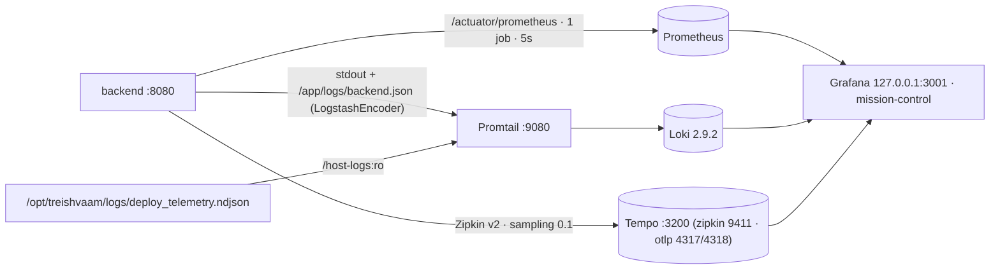

# BE-06 — OBSERVABILITY: Metrics, Logs, Traces, Telemetry Reality

> **Verification basis:** source export (obs configs, logback, actuator props) · frontend telemetry code (`faroConfig.js`, `aegis-biometrics.ts`, `WebVitalsTracker.tsx`) · SKILLS REF_3. **Re-verified 2026-08-23 — one substantive correction:** the Grafana provisioning bodies **do exist** in the export (see §5); the earlier "absent / OP-11" claim was wrong.

---

## 1. Stack Topology

## 2. Metrics — Prometheus

Single job `treishvaam-backend` → `backend:8080/actuator/prometheus`, global `scrape_interval 5s`, no `remote_write`. Spring: exposure `health,prometheus`; details `when-authorized` (ROLE_ADMIN); Resilience4j indicators on (`pythonScript`, `fmpApi`). Primary series: `http_server_requests_seconds_{count,sum}`. ⚠ No infra exporters (MariaDB/Rabbit/Redis/host) — legacy claims of multi-job scraping are wrong. All new endpoints must carry Micrometer instrumentation (REF_3 rule).

## 3. Logs — Logback JSON → Promtail → Loki

- `logback-spring.xml`: `CONSOLE_JSON` + `FILE_JSON` (`/app/logs/backend.json`, 10 MB × 7 d × 100 MB cap), `LogstashEncoder` customFields `{"app_name":"finance-api"}`, root INFO; MDC (`requestId`, `tenantId`) serialized implicitly.
- Promtail (:9080), static configs: `varlogs` `/app/logs/*.json` + `engine-b-deploy` `/host-logs/deploy_telemetry.ndjson` (json → timestamp → labels `run_id/phase/status` → output).
- Loki 2.9.2: boltdb-shipper v11 filesystem, replication 1, ingestion raised to 50 MB/s (default-429 fix), ruler → `localhost:9093`. ⚠ No retention/compactor — unbounded growth.
- Access: Grafana `127.0.0.1:3001` + RabbitMQ `127.0.0.1:15672` via SSH tunnel.

## 4. Traces — Tempo

Zipkin receiver `:9411` (Spring endpoint `http://tempo:9411/api/v2/spans`), OTLP `:4317/:4318`, local block store. Sampling 0.1 (prod). `X-Request-ID` correlates logs ↔ traces (backend-generated; the frontend does not set it).

## 5. Grafana — Mission Control

3 panels (refresh 5 s, 15 m window): Traffic `rate(http_server_requests_seconds_count[1m])` by method/uri · Latency sum/count ratio · Logs `{job="varlogs"} | json`.

**Provisioning reality (corrected 2026-08-23 — resolves OP-11):** the export **does contain** the provisioning bodies, and compose mounts all of them (`docker-compose.yml:792-796`):

| Artifact | Content (verified) |
|---|---|
| `config/grafana-alerting.yml` (9.4 KB) | **5 full Grafana-managed alert rules**, group "Treishvaam Critical Alerts", 1 m interval: `high_error_rate` (High API Error Rate) · `high_backend_error_rate` (5xx > 5 %) · `slow_api_response` (p95 > 2 s) · `secret_key_rotation_due` (`/opt/treishvaam/key_rotation.log` mtime > 90 d) · `engine_b_stuck_in_progress` (Dead-Man's Switch, Loki-based: STARTUP without terminal telemetry event within 5 min) |
| `dashboards/mission-control.json` (4.3 KB) | the Mission Control dashboard body |
| `config/grafana-datasources.yml` | Prometheus (default, :9090) · Loki (:3100, TraceID derived field → Tempo) · Tempo (:3200) |
| `config/grafana-dashboards.yml` | file provider → `/var/lib/grafana/dashboards` |

Note: rule **uids are snake_case** (`high_backend_error_rate`, …) — the CamelCase names (`HighBackendErrorRate`) used in older REF docs are display aliases, not identifiers.

## 6. Client Telemetry (the real pipelines)

| Pipeline | Producer → Endpoint | Cadence | Notes |
|---|---|---|---|
| First-party analytics | `faroConfig.js` `postEvent` → **`POST /api/v1/analytics/event`** (sendBeacon for `exit_intent/page_unload/visibility_hidden`; `fetch keepalive` otherwise) | on-event | events `page_view, scroll_depth, visibility_hidden, page_unload, exit_intent, web_vital` (`metricId` rename); sessionId per-tab UUID; `extra.platformVersion` Win11 Client-Hints |
| AEGIS L5-BIE biometrics | `aegis-biometrics.ts` → **`POST /api/v1/aegis/telemetry`** | **15 s** | **mousemove + keydown** listeners only (no scroll — verified `aegis-biometrics.ts:124-125`, 2026-08-23); entropy hashed client-side via WebCrypto **SHA-256** (FE README/FE-04 claim of SHA3-256 is wrong — OP-21); headers `X-Aegis-Biometric-Hash` (+`-Raw` — **the raw vector is transmitted by default** unless `NEXT_PUBLIC_ENFORCE_STRICT_PRIVACY=true`, which the worker sets to `"false"`); SSR-safe (no `window`) |
| Faro web-vitals | `faroConfig.js` → `NEXT_PUBLIC_FARO_URL` (default `https://backend.treishvaamgroup.com/faro/collect`) | on-load/vital | app `treishvaam-finance-frontend`; `faro.api.setUser` post-auth. ⚠ **No frontend call to `/api/v1/monitoring/ingest` exists** — the controller (→ `audience_visits` + forward `http://alloy:12347/collect`) is verified backend code but currently unexercised by the FE (OP-20) |
| GA4 / Ads | `app/layout.tsx` + deferred `ThirdPartyScripts.js` (interaction-gated: scroll/mousemove/touch/7 s) | — | `anonymize_ip` only when `NEXT_PUBLIC_ENFORCE_STRICT_PRIVACY=true` |

Server-side analytics jobs: `syncAegisTelemetryToAudienceVisits` 5 min · GA4 Data API daily 02:00 · BigQuery gated off · retention purge 03:30 (>365 d, DPDP).

## 7. Open Items (⚠)

~~OP-11 provisioning bodies~~ **resolved 2026-08-23** (bodies exist + are mounted — §5) · OP-20 Faro endpoint mismatch (re-confirmed 2026-08-23: no `/api/v1/monitoring/ingest` call anywhere in the frontend repo) · biometric hashing is **SHA-256**, not SHA3-256 (re-confirmed: `aegis-biometrics.ts:87` `crypto.subtle.digest('SHA-256', …)` — OP-21) · Loki retention absent · no AEGIS-decision metrics exported (BLOCK/TARPIT counts live only in logs) · Alloy container referenced (`:12347`) but absent from compose · `X-Request-ID` unverified end-to-end (frontend never sets it).
