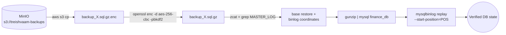

# DISASTER_RECOVERY — Treishvaam BCDR Plan (`finance-api`)

> **Location:** `finance-api/docs/DISASTER_RECOVERY.md` · **Version:** 1.1 (2026-08-23 re-verification: restore.sh-no-decrypt warning re-confirmed against source; Keycloak Web Origins wording made literal)
> **Companion:** `RUNBOOKS.md` (routine ops) · `BE-03-DEPLOYMENT.md` (pipeline detail). All commands verified against the repository scripts.

---

## 0. Severity Ladder & Contacts

| Sev | Event | Target |
|---|---|---|
| **1** | Host network bridge collapse (SSH dead) | Console recovery — this doc §1 |
| **1** | Data loss / corruption | PITR — §2 |
| **2** | Identity provider down (all logins fail) | §3 |
| **2** | Edge/backend MTD split-brain (admin routes 404) | §4 |
| **3** | Bad frontend release | §5 |

Deployment truth sources during any incident: **Telegram bot + `/opt/treishvaam/deploy_pipeline.log` + `/opt/treishvaam/logs/deploy_telemetry.ndjson`** (Golden Rule: SSH visibility can lie mid-deploy).

---

## 1. Sev-1 — Host Network Bridge Collapse (`docker compose down` executed)

**Cause chain:** `down` deletes the `treish_net` bridge → host routing/Cloudflare-tunnel bindings collapse → **all SSH dies**. Recovery requires an out-of-band console (VirtualBox console / hypervisor). The fix script is `scripts/kernel-mount-recovery.sh`, whose exact behavior is: stop `docker.socket docker containerd` → lazy-unmount every `/var/lib/docker` overlay (`umount -l`) → purge ghost container metadata (`/var/lib/docker/containers/*`, containerd moby tasks) → restart `containerd docker docker.socket`. It repairs **Docker state only** — it does not touch iptables or the OS routing table.

**Procedure:**
1. Hypervisor/VirtualBox console login (`vboxuser`). Do **not** reboot first — the lazy-umount deadlock survives reboots and gets worse.
2. Run the recovery engine:
   ```bash
   sudo bash /opt/treishvaam/scripts/kernel-mount-recovery.sh
   # expect: "Kernel mount recovery complete. System sanitized."
   ```
3. Verify the host: `ip a` (bridge recreated on next `up`), `systemctl status docker containerd`, `docker network ls` (recreate `treish_net` implicitly at step 4).
4. Re-ignite in dependency order (never `down`; tiered `--no-deps` — full tier list in `BE-03-DEPLOYMENT.md §4`). Minimum viable stack:
   ```bash
   cd /opt/treishvaam
   docker compose up -d --no-deps treishvaam-db keycloak-db treishvaam-redis redis minio
   docker compose up -d --no-deps elasticsearch rabbitmq wazuh-manager
   docker compose up -d --no-deps aegis-zkp-service aegis-canary-server tunnel
   docker compose up -d --no-deps --scale backend=1 backend
   docker compose up -d --force-recreate --no-deps nginx
   curl -s localhost/actuator/health   # then scale back:
   docker compose up -d --scale backend=2 backend
   ```
5. Verify edge path: Cloudflare tunnel reconnects automatically (`docker logs tunnel`) → `curl -s -o /dev/null -w "%{http_code}" https://treishvaamfinance.com/llms.txt` (expect `200`).
6. **Runner heartbeat** was severed by the bridge flap: `sudo -n systemctl restart actions.runner.*`.
7. Post-incident: append the event to the Knowledge Tracker; verify no container lost its volume (`docker volume ls` vs baseline).

> [!CAUTION]
> If `docker rm -f` of any container hangs during recovery, re-run `kernel-mount-recovery.sh` — a `dead`/`created` ghost holding a port/DNS name is the classic secondary deadlock (Engine B purges these automatically with the same script as fallback).

---

## 2. Sev-1 — Point-in-Time Recovery (PITR)

**Assets:** nightly encrypted dumps in MinIO `s3://treishvaam-backups` (`backup_YYYY-MM-DD_HH-MM-SS.sql.gz.enc`, **7-day retention**, AES-256-CBC-PBKDF2 via `BACKUP_ENCRYPTION_KEY`) · ROW binlogs in the DB volume (`mysql-bin.*`, encrypted, 7-day expiry, 256 MB rotation) · dump headers carry `--master-data=2` coordinates.

> [!WARNING]
> **`backup/restore.sh` does not decrypt.** It was written before backup-side encryption (Phase 4) and pipes the downloaded `.enc` straight into `gunzip` — it will fail on current backups. Use the manual pipeline below (and treat a `restore.sh` update as a P2 code fix).



**Step-by-step (on the VM):**
1. **List & download:**
   ```bash
   docker exec backup-service aws --endpoint-url http://minio:9000 s3 ls s3://treishvaam-backups/
   docker exec backup-service aws --endpoint-url http://minio:9000 s3 cp \
     s3://treishvaam-backups/backup_<DATE>.sql.gz.enc /tmp/restore.enc
   docker cp backup-service:/tmp/restore.enc /opt/treishvaam/restore.enc
   ```
2. **Decrypt** (never echo the key into shell history — prefer a prompt):
   ```bash
   openssl enc -d -aes-256-cbc -pbkdf2 -pass env:BACKUP_ENCRYPTION_KEY \
     -in /opt/treishvaam/restore.enc -out /opt/treishvaam/restore.sql.gz
   # (export BACKUP_ENCRYPTION_KEY first, sourced from Infisical)
   ```
3. **Read the binlog coordinates** embedded by `--master-data=2`:
   ```bash
   zcat /opt/treishvaam/restore.sql.gz | grep -m1 "MASTER_LOG"
   # --> -- CHANGE MASTER TO MASTER_LOG_FILE='mysql-bin.000042', MASTER_LOG_POS=123456;
   ```
4. **Restore the base** (overwrites `finance_db` — confirm you are on the right target):
   ```bash
   docker exec -i treishvaam-db sh -c 'exec mariadb -u root -p"$MARIADB_ROOT_PASSWORD"' < <(gunzip -c /opt/treishvaam/restore.sql.gz)
   # or: gunzip < restore.sql.gz | docker exec -i treishvaam-db mariadb -u root -p"…" finance_db
   ```
5. **Replay binlogs to the desired moment** — *inside* the DB container (binlogs are TDE-encrypted; the keyfile exists only there):
   ```bash
   # from the recorded position, through every subsequent log (optionally --stop-datetime):
   docker exec treishvaam-db sh -c \
     'mysqlbinlog --start-position=123456 /var/lib/mysql/mysql-bin.000042 | mariadb -u root -p"$MARIADB_ROOT_PASSWORD" finance_db'
   docker exec treishvaam-db sh -c \
     'mysqlbinlog /var/lib/mysql/mysql-bin.000043 | mariadb -u root -p"$MARIADB_ROOT_PASSWORD" finance_db'
   # add --stop-position=NNN or --stop-datetime="2026-08-22 14:30:00" to land precisely before the incident
   ```
6. **Verify & clean:** row counts on key tables (`blog_posts`, `analytics_events`) · app smoke test · `find / -name "restore*" -delete` hygiene + Flash & Wipe the `.env`.

**Boundary conditions:** binlogs older than 7 days are expired (PITR granularity = last nightly dump → now, within the binlog window). If the DB **volume** was destroyed, binlogs are gone — recovery is dump-only (point = backup time). Encrypted backups need `BACKUP_ENCRYPTION_KEY`; pre-rotation binlogs additionally need the **old TDE key** (see RUNBOOKS §5).

---

## 3. Sev-2 — Identity Provider Recovery (Keycloak 25)

**Sources of truth:** `config/keycloak/realm-export.json` (repo) + dedicated `keycloak-db` MariaDB. The compose service runs `start --import-realm` with the realm file mounted into the import directory — a fresh database gets the realm automatically (import **skips existing** realms by default).

**Scenario A — keycloak-db lost/corrupt:**
```bash
cd /opt/treishvaam
docker compose stop keycloak keycloak-db
docker volume rm <keycloak-db-volume>            # inspect: docker inspect keycloak-db
docker compose up -d --no-deps keycloak-db && sleep 20
docker compose up -d --no-deps keycloak          # start --import-realm rebuilds realm 'treishvaam'
```
**Scenario B — realm misconfigured / poisoned settings:** stop keycloak, drop/rename the realm schema (or wipe the volume as above) → restart → clean re-import from `realm-export.json`.

**Post-recovery checklist:**
1. Admin console: `https://backend.treishvaamgroup.com/auth/` — login `keycloak-admin` / `${KEYCLOAK_ADMIN_PASSWORD}` (env in Infisical).
2. ⚠ The realm export's only user (`admin`) carries the **temporary placeholder password `RESET_ME_IN_ADMIN_CONSOLE`** — reset it immediately and re-assign realm roles (`admin`, `publisher`, `editor`).
3. Verify OIDC endpoints the backend depends on:
   ```bash
   curl -s https://backend.treishvaamgroup.com/auth/realms/treishvaam/.well-known/openid-configuration | head -5
   curl -s "http://keycloak:8080/auth/realms/treishvaam/protocol/openid-connect/certs"   # from inside treish_net, or via backend JWKS env
   ```
4. Confirm clients: `finance-app` (public, PKCE, Web Origins literally `https://treishvaamfinance.com` · `https://www.treishvaamfinance.com` · `http://localhost:3000` · `+` — the `+` wildcard covers all registered redirect-URI origins, which is the subdomain coverage) and `finance-api` (bearer-only). Brute-force protection reactivates from the export (5 failures → 60 s initial lockout, 900 s max).
5. User impact note: all user sessions/tokens invalidate on realm rebuild — users re-login. The backend itself needs no restart (it fetches JWKS per token validation with Spring's cache).

---

## 4. Sev-2 — MTD Split-Brain (Edge KV vs Backend Redis manifest)

**Symptoms:** Worker-translated `/api/v1/node/{hex}` calls return 404/401 (stale hex) while direct canonical access still gets DECEPTION responses; or admin dashboard works from one path but not another. Root cause: replicas booting independent manifests (fixed structurally by the `setIfAbsent` lock `aegis:mtd:lock` — Incident 29/30 — but a stale KV copy or stuck lock can still desync).

**Diagnosis:**
```bash
# backend truth:
docker exec treishvaam-redis redis-cli --raw GET aegis:mtd:manifest | head -c 300; echo
# edge truth (API read; or Dashboard → Workers KV → AEGIS_THREAT_KV → key aegis:mtd:manifest):
curl -s "https://api.cloudflare.com/client/v4/accounts/${CLOUDFLARE_ACCOUNT_ID}/storage/kv/namespaces/${CLOUDFLARE_THREAT_KV_NAMESPACE_ID}/values/aegis:mtd:manifest" \
     -H "Authorization: Bearer ${CLOUDFLARE_API_TOKEN}" | head -c 300; echo
# stuck lock?:
docker exec treishvaam-redis redis-cli TTL aegis:mtd:lock
```

**Re-sync procedure (force a clean regeneration):**
```bash
docker exec treishvaam-redis redis-cli DEL aegis:mtd:lock
docker exec treishvaam-redis redis-cli DEL aegis:mtd:manifest
docker compose restart backend        # @PostConstruct rotateManifest(): lock → generate → Redis(24h TTL) → KV push
```
Verify both stores now match (re-run the diagnosis), then exercise one admin route through the domain. The Worker reads the manifest per request (no local cache beyond the isolate's fetch), so no edge-side action is needed; optionally `curl https://treishvaamfinance.com/sys/force-update` to confirm the worker is alive.

> [!IMPORTANT]
> Rotating the manifest invalidates in-flight translated URLs for up to a few seconds — this is by design (MTD). If splits recur, check that both backend replicas can reach Redis (the lock is what prevents dual-master manifests) and that nothing deleted the Redis key mid-window.

---

## 5. Sev-3 — Frontend Rollback (Next.js on Cloudflare Pages + Worker)

**Pages (the Next.js app):**
1. Dashboard → Workers & Pages → `treishvaam-finance-frontend` → **Deployments** → previous known-good build → **Instant rollback** (aliases flip immediately; no rebuild).
2. ⚠ **Env-var caveat:** `NEXT_PUBLIC_*` values are baked at build time — rolling back also rolls back the *variables* that build carried. If the incident was caused by a variable change (not code), fix the variable and push an empty commit to force a fresh build instead of rolling back.
3. Purge caches: zone **Cache Purge** + Worker KV if the bad build polluted keys (`/sys/purge-cache`, see RUNBOOKS §3) — and remember the PWA service-worker caveat (users may need a hard refresh / SW update cycle).

**Worker (`treishfin-seo-worker`)** — separate deployable from Pages:
```bash
cd worker
npx wrangler deployments list      # find the last good version
npx wrangler rollback              # or: npx wrangler deploy --version-id <id>
```
Verify: `/llms.txt` 200, a market widget SSR page, and one MTD-protected call through the domain (proves signing + translation). If the worker rollback alone doesn't restore behavior, check KV state (§4) before touching Pages.

**Full-stack nuclear path (backend regressions):** the WAR is host-mounted — `cd /opt/treishvaam`, restore the previous `backend-app.war` from git history on the workstation (`git show <rev>:target/finance-api.war` artifacts are not in git; use the last CI artifact or rebuild from the previous GPG-signed tag), copy over, `docker compose up -d --force-recreate --no-deps backend`. Verify `/actuator/health` then re-scale to 2.

---

## 6. Backup Health (standing verification)

| Check | Command | Expectation |
|---|---|---|
| Last backup object | `docker exec backup-service aws --endpoint-url http://minio:9000 s3 ls s3://treishvaam-backups/ \| tail -1` | ≤ 24 h old, `.sql.gz.enc` |
| Backup container alive | `docker ps --filter name=backup` | `Up` |
| Decryption drill (quarterly) | §2 steps 1–2 on the newest object, then delete | decrypts cleanly, `zcat \| head` shows SQL |
| Binlog freshness | `docker exec treishvaam-db sh -c 'ls -lt /var/lib/mysql/mysql-bin.* \| head -3'` | files within retention, current one growing |

*Any failed check is a Sev-2 finding — fix before the next maintenance window.*
